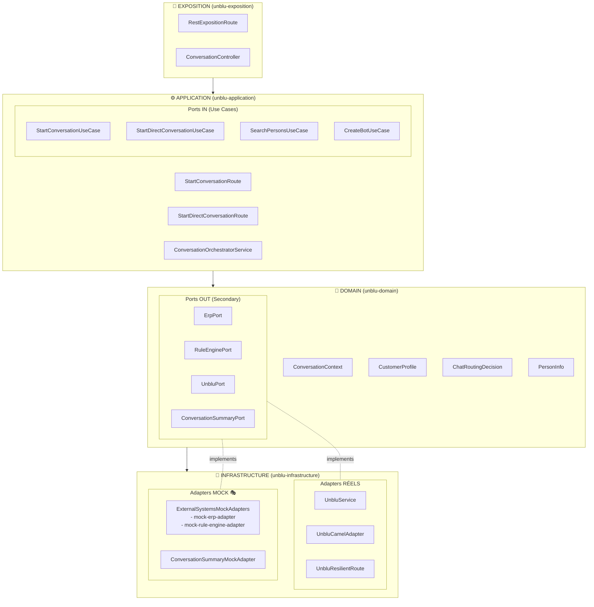
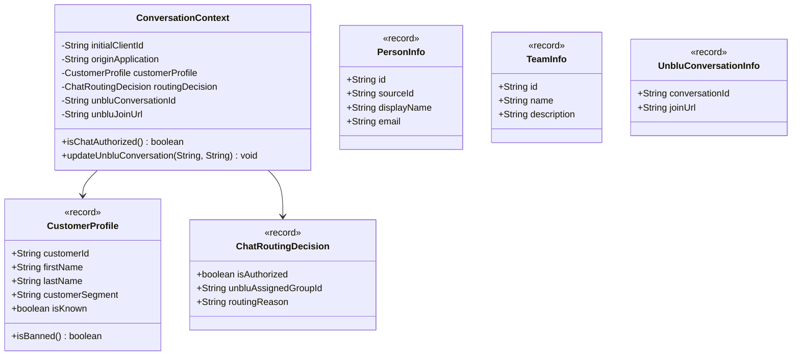

# Architecture Hexagonale - PoC Unblu

## 📋 Table des matières

1. [Vue d'ensemble](#vue-densemble)
2. [Modules du projet](#modules-du-projet)
3. [Architecture Hexagonale](#architecture-hexagonale)
4. [Adapters](#adapters)

---

## 🎯 Vue d'ensemble

Ce PoC (Proof of Concept) démontre l'intégration d'Unblu (plateforme de chat en direct) dans une architecture orientée microservices utilisant **Apache Camel** pour l'orchestration et le **pattern Hexagonal** (ports & adapters).

### Objectifs du PoC

- Créer des conversations Unblu avec routage intelligent
- Intégrer des systèmes externes (ERP, moteur de règles)
- Gérer la résilience avec circuit breaker
- Générer des résumés de conversation automatiques

---

## 📦 Modules du projet

Le projet est organisé en 5 modules Maven suivant l'architecture hexagonale :

### 1. unblu-domain (Cœur métier)

**Responsabilité** : Définit les concepts métiers purs, indépendants de toute technologie.

**Contenu** :
- Modèles métier (ConversationContext, CustomerProfile, ChatRoutingDecision, etc.)
- Ports IN (interfaces des cas d'usage)
- Ports OUT (interfaces des adaptateurs secondaires)
- Logique métier pure

**Aucune dépendance externe** : Pas de Spring, Camel, ou SDK tiers.

📂 `unblu-domain/`

---

### 2. unblu-application (Orchestration)

**Responsabilité** : Implémente les cas d'usage et orchestre les flux métier avec Apache Camel.

**Contenu** :
- Routes Camel (StartConversationRoute, StartDirectConversationRoute)
- Services d'orchestration (ConversationOrchestratorService)
- Implémentation des ports IN

**Dépendances** :
- `unblu-domain` (dépend du cœur métier)
- Apache Camel
- Spring Boot

📂 `unblu-application/`

---

### 3. unblu-infrastructure (Adapters)

**Responsabilité** : Implémente les ports OUT avec des adaptateurs techniques réels et mocks.

**Contenu** :
- Adaptateurs Unblu (UnbluService, UnbluCamelAdapter)
- Adaptateurs mock (ERP, moteur de règles, générateur de résumés)
- Routes de résilience (Circuit Breaker)

**Dépendances** :
- `unblu-domain` (implémente les ports OUT)
- SDK Unblu
- Resilience4j
- Apache Camel

📂 `unblu-infrastructure/`

---

### 4. unblu-exposition (API REST)

**Responsabilité** : Expose les services via des endpoints REST.

**Contenu** :
- Contrôleurs REST (ConversationController)
- Routes d'exposition Camel (RestExpositionRoute)
- Configuration OpenAPI/Swagger

**Dépendances** :
- `unblu-application`
- Spring Web
- Apache Camel REST

📂 `unblu-exposition/`

---

### 5. unblu-configuration (Application)

**Responsabilité** : Point d'entrée de l'application, configuration globale.

**Contenu** :
- Classe `@SpringBootApplication`
- Configuration Spring
- Propriétés d'environnement

**Dépendances** : Tous les autres modules

📂 `unblu-configuration/`

---

## 🏗️ Architecture Hexagonale

### Vue d'ensemble



---

### 📐 Modèle de classes métier



---

## 📚 Concepts métiers

### 1. ConversationContext

**Rôle** : Objet pivot enrichi tout au long de l'orchestration (pattern Content Enricher).

**Attributs** :
```java
- initialClientId: String          // ID externe du client
- originApplication: String         // Origine de la demande
- customerProfile: CustomerProfile  // Profil client enrichi depuis l'ERP
- routingDecision: ChatRoutingDecision // Décision de routage du moteur de règles
- unbluConversationId: String       // ID de la conversation Unblu créée
- unbluJoinUrl: String              // URL de connexion au chat
```

**Méthodes métier** :
- `isChatAuthorized()`: Vérifie si le client peut accéder au chat
- `updateUnbluConversation()`: Met à jour les infos Unblu après création

📄 Fichier : `unblu-domain/src/main/java/org/dbs/poc/unblu/domain/model/ConversationContext.java`

---

### 2. CustomerProfile

**Rôle** : Profil client récupéré depuis l'ERP.

**Attributs** :
```java
- customerId: String
- firstName: String
- lastName: String
- customerSegment: String  // VIP, STANDARD, BANNED
- isKnown: boolean
```

**Méthodes métier** :
- `isBanned()`: Vérifie si le segment est "BANNED"

📄 Fichier : `unblu-domain/src/main/java/org/dbs/poc/unblu/domain/model/CustomerProfile.java`

---

### 3. ChatRoutingDecision

**Rôle** : Décision de routage du moteur de règles métier.

**Attributs** :
```java
- isAuthorized: boolean
- unbluAssignedGroupId: String  // ID de l'équipe Unblu assignée
- routingReason: String         // Raison de la décision
```

**Validation** : Si `isAuthorized = true`, alors `unbluAssignedGroupId` est obligatoire.

📄 Fichier : `unblu-domain/src/main/java/org/dbs/poc/unblu/domain/model/ChatRoutingDecision.java`

---

### 4. PersonInfo

**Rôle** : Représente une personne dans Unblu (client VIRTUAL ou agent USER_DB).

**Attributs** :
```java
- id: String          // ID interne Unblu
- sourceId: String    // ID externe (source système)
- displayName: String
- email: String
```

**Sources possibles** : `VIRTUAL` (client), `USER_DB` (agent).

📄 Fichier : `unblu-domain/src/main/java/org/dbs/poc/unblu/domain/model/PersonInfo.java`

---

### 5. TeamInfo

**Rôle** : Équipe d'agents Unblu (file d'attente).

**Attributs** :
```java
- id: String
- name: String
- description: String
```

📄 Fichier : `unblu-domain/src/main/java/org/dbs/poc/unblu/domain/model/TeamInfo.java`

---

### Ports IN (Use Cases)

Les ports IN sont les interfaces que l'application expose pour être utilisées par les adaptateurs primaires (REST, CLI, etc.).

#### StartConversationUseCase

**Responsabilité** : Démarrer une conversation avec une équipe.

**Signature** :
```java
ConversationContext startConversation(StartConversationCommand command);
```

📄 Fichier : `unblu-domain/src/main/java/org/dbs/poc/unblu/domain/port/in/StartConversationUseCase.java`

---

#### StartDirectConversationUseCase

**Responsabilité** : Démarrer une conversation directe 1-to-1.

**Signature** :
```java
UnbluConversationInfo startDirectConversation(StartDirectConversationCommand command);
```

📄 Fichier : `unblu-domain/src/main/java/org/dbs/poc/unblu/domain/port/in/StartDirectConversationUseCase.java`

---

#### SearchPersonsUseCase

**Responsabilité** : Rechercher des personnes Unblu.

**Signature** :
```java
List<PersonInfo> searchPersons(PersonSource source, String sourceId);
```

📄 Fichier : `unblu-domain/src/main/java/org/dbs/poc/unblu/domain/port/in/SearchPersonsUseCase.java`

---

#### CreateBotUseCase

**Responsabilité** : Créer un bot Unblu.

**Signature** :
```java
String createBot(String name, String description);
```

📄 Fichier : `unblu-domain/src/main/java/org/dbs/poc/unblu/domain/port/in/CreateBotUseCase.java`

---

### Ports OUT (Secondary)

Les ports OUT sont les interfaces que le domaine définit pour interagir avec l'extérieur (systèmes externes, APIs, bases de données).

#### UnbluPort

**Responsabilité** : Interface pour interagir avec l'API Unblu.

**Méthodes** :
```java
ConversationContext createConversation(ConversationContext context);
List<PersonInfo> searchPersons(PersonSource source, String sourceId);
List<TeamInfo> searchTeams();
UnbluConversationInfo createDirectConversation(PersonInfo client, PersonInfo agent, String subject);
void addConversationSummary(String conversationId, String summary);
String createBot(String name, String description);
```

📄 Fichier : `unblu-domain/src/main/java/org/dbs/poc/unblu/domain/port/out/UnbluPort.java`

---

#### ErpPort

**Responsabilité** : Interface pour récupérer les profils clients depuis l'ERP.

**Méthodes** :
```java
CustomerProfile getCustomerProfile(String customerId);
```

📄 Fichier : `unblu-domain/src/main/java/org/dbs/poc/unblu/domain/port/out/ErpPort.java`

---

#### RuleEnginePort

**Responsabilité** : Interface pour le moteur de règles de routage.

**Méthodes** :
```java
ChatRoutingDecision evaluateRoutingRules(ConversationContext context);
```

📄 Fichier : `unblu-domain/src/main/java/org/dbs/poc/unblu/domain/port/out/RuleEnginePort.java`

---

#### ConversationSummaryPort

**Responsabilité** : Interface pour générer des résumés de conversation.

**Méthodes** :
```java
String generateSummary(String conversationId);
```

📄 Fichier : `unblu-domain/src/main/java/org/dbs/poc/unblu/domain/port/out/ConversationSummaryPort.java`

---

## 🔌 Adapters

### Adapters Primaires (Driving Adapters)

Les adapters primaires pilotent l'application en appelant les ports IN.

#### RestExpositionRoute

**Type** : REST Adapter (Camel)

**Responsabilité** : Expose les endpoints REST.

**Endpoints** :
- `POST /api/conversations/team` → `direct:start-conversation`
- `POST /api/conversations/direct` → `direct:start-direct-conversation`
- `GET /api/persons` → `direct:unblu-search-persons`
- `GET /api/teams` → `direct:unblu-search-teams`
- `POST /api/bots` → `direct:unblu-create-bot`

📄 Fichier : `unblu-exposition/src/main/java/org/dbs/poc/unblu/exposition/rest/RestExpositionRoute.java`

---

#### ConversationController

**Type** : REST Controller (Spring)

**Responsabilité** : Alternative au routing Camel pour exposer les endpoints REST.

📄 Fichier : `unblu-exposition/src/main/java/org/dbs/poc/unblu/exposition/controller/ConversationController.java`

---

### Adapters Secondaires (Driven Adapters)

Les adapters secondaires implémentent les ports OUT définis par le domaine.

#### UnbluService

**Type** : Adapter technique RÉEL

**Responsabilité** : Implémente `UnbluPort` en utilisant le SDK Unblu.

**Méthodes implémentées** :
- Création de conversations
- Recherche de personnes et équipes
- Envoi de messages bot
- Gestion des participants

**APIs Unblu utilisées** :
- `PersonsApi`
- `ConversationsApi`
- `TeamsApi`
- `BotsApi`

📄 Fichier : `unblu-infrastructure/src/main/java/org/dbs/poc/unblu/infrastructure/adapter/unblu/UnbluService.java`

---

#### UnbluCamelAdapter

**Type** : Adapter Camel (orchestration)

**Responsabilité** : Enrobe `UnbluService` dans une route Camel.

**Route** : `direct:unblu-adapter`

**Flux** :
1. Reçoit un `ConversationContext`
2. Appelle `UnbluService.createConversation()`
3. Retourne le contexte enrichi

📄 Fichier : `unblu-infrastructure/src/main/java/org/dbs/poc/unblu/infrastructure/adapter/unblu/UnbluCamelAdapter.java`

---

#### UnbluResilientRoute

**Type** : Adapter Camel avec résilience

**Responsabilité** : Wrapper de `UnbluCamelAdapter` avec Circuit Breaker.

**Route** : `direct:unblu-adapter-resilient`

**Configuration** :
- Timeout : 3000ms
- Fallback : Retourne un contexte avec `conversationId = "OFFLINE-PENDING"`

**Pattern utilisé** : Circuit Breaker (Resilience4j)

📄 Fichier : `unblu-infrastructure/src/main/java/org/dbs/poc/unblu/infrastructure/adapter/unblu/UnbluResilientRoute.java`

---

#### ConversationSummaryMockAdapter

**Type** : Adapter MOCK 🎭

**Responsabilité** : Implémente `ConversationSummaryPort` avec des résumés générés aléatoirement.

**Route** : `direct:conversation-summary-adapter`

**Comportement** :
```java
String generateSummary(String conversationId) {
    String line1 = randomFromList(LINE1);
    String line2 = randomFromList(LINE2);
    return line1 + "\n" + line2;
}
```

**Exemples de résumés** :
```
"Le client a contacté le service pour une demande d'information sur ses produits.
Un conseiller spécialisé a été assigné pour traiter la demande en priorité."
```

**⚠️ À remplacer par** : Appel à une API d'IA générative (OpenAI, Claude, etc.)

📄 Fichier : `unblu-infrastructure/src/main/java/org/dbs/poc/unblu/infrastructure/adapter/summary/ConversationSummaryMockAdapter.java`

---

#### ExternalSystemsMockAdapters

**Type** : Adapter MOCK 🎭

**Responsabilité** : Implémente `ErpPort` et `RuleEnginePort` avec des données fictives.

**Routes** :
- `direct:erp-adapter` → Retourne un `CustomerProfile` simulé
- `direct:rule-engine-adapter` → Retourne une `ChatRoutingDecision` simulée

**Comportement** :
- ERP : Génère des profils clients avec segments (VIP, STANDARD, BANNED)
- Rule Engine : Autorise/refuse l'accès au chat selon le segment

**⚠️ À remplacer par** :
- ERP : Connecteur REST/SOAP vers le vrai ERP
- Rule Engine : Intégration Drools ou autre moteur de règles

📄 Fichier : `unblu-infrastructure/src/main/java/org/dbs/poc/unblu/infrastructure/adapter/external/ExternalSystemsMockAdapters.java`

---

### Endpoints Camel

| Endpoint                                  | Description                          | Type     | Statut |
|-------------------------------------------|--------------------------------------|----------|--------|
| `direct:start-conversation`               | Workflow conversation avec équipe    | Route    | ✅ Actif |
| `direct:start-direct-conversation`        | Workflow conversation 1-to-1         | Route    | ✅ Actif |
| `direct:conversation-summary-adapter`     | Génération résumé                   | 🎭 MOCK  | ✅ Actif |
| `direct:unblu-adapter-resilient`          | Création conversation Unblu + CB    | Réel     | ✅ Actif |
| `direct:unblu-adapter`                    | Création conversation Unblu (base)  | Réel     | ✅ Actif |
| `direct:unblu-search-persons`             | Recherche personnes Unblu           | Réel     | ✅ Actif |
| `direct:unblu-search-teams`               | Recherche équipes Unblu             | Réel     | ✅ Actif |
| `direct:unblu-create-direct-conversation` | Conversation directe Unblu          | Réel     | ✅ Actif |
| `direct:unblu-add-summary`                | Ajout résumé (message bot)          | Réel     | ✅ Actif |
| `direct:erp-adapter`                      | Appel ERP                           | 🎭 MOCK  | ⏸️ Non utilisé |
| `direct:rule-engine-adapter`              | Moteur de règles                    | 🎭 MOCK  | ⏸️ Non utilisé |

---

## 📞 Endpoints REST exposés

| Méthode | Endpoint                          | Description                    |
|---------|-----------------------------------|--------------------------------|
| POST    | `/api/conversations/team`         | Conversation avec équipe       |
| POST    | `/api/conversations/direct`       | Conversation 1-to-1            |
| GET     | `/api/persons`                    | Recherche personnes Unblu      |
| GET     | `/api/teams`                      | Liste des équipes              |
| POST    | `/api/bots`                       | Création d'un bot              |

---

## 🔧 Dépendances clés

**SDK Unblu** :
```xml
<dependency>
    <groupId>com.unblu.openapi</groupId>
    <artifactId>jersey3-client-v4</artifactId>
    <version>8.30.1</version>
</dependency>
<dependency>
    <groupId>com.unblu.openapi</groupId>
    <artifactId>models-v4</artifactId>
    <version>8.30.1</version>
</dependency>
```

**Apache Camel** :
```xml
<dependency>
    <groupId>org.apache.camel.springboot</groupId>
    <artifactId>camel-spring-boot-starter</artifactId>
    <version>4.18.0</version>
</dependency>
```

**Resilience4j** (Circuit Breaker) :
```xml
<dependency>
    <groupId>org.apache.camel</groupId>
    <artifactId>camel-resilience4j</artifactId>
    <version>4.18.0</version>
</dependency>
```

---

## 🔍 Glossaire

| Terme                | Définition                                                     |
|----------------------|----------------------------------------------------------------|
| **VIRTUAL**          | Source de personne Unblu représentant un client externe        |
| **USER_DB**          | Source de personne Unblu représentant un agent/utilisateur     |
| **Team**             | Équipe d'agents Unblu (file d'attente)                        |
| **Circuit Breaker**  | Pattern de résilience pour gérer les défaillances             |
| **Content Enricher** | Pattern Camel d'enrichissement progressif d'un objet           |
| **Objet Pivot**      | Objet métier central enrichi au fil de l'orchestration        |
| **Mock Adapter**     | Simulateur de système externe pour tests                       |
| **sourceId**         | Identifiant externe d'une personne (système source)           |
| **personId**         | Identifiant interne Unblu d'une personne                      |
| **Port IN**          | Interface d'entrée (use case) appelée par les adapters primaires |
| **Port OUT**         | Interface de sortie (dépendance externe) implémentée par les adapters secondaires |

---

**Auteur** : Documentation générée à partir de l'analyse du code
**Date** : 2026-03-18
**Version** : 3.0
