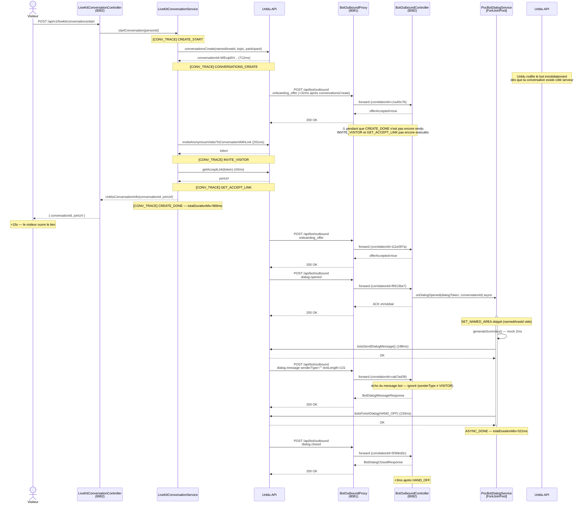

# Analyse de séquence bot → LiveKit

> Sessions enregistrées le 2026-04-26  
> Session 1 — 18h47 — Conversation : `1i2eyr7LRhC8j7uK-Av7rw` — Person : `kWiZxECTRxmMXBOBgwXIGg`  
> Session 2 — 18h55 — Conversation : `dlDdMb4HQa-HGLEDRdQFcg` — Person : `7rWA8x_WTfKlrLAslh5grA`  
> Session 3 — 19h04 — Conversation : `WEuipEHdS1mU59j0aTvYkQ` — Person : `6K70w0e7TrqWReVPEb_PeA`

---

## Timeline reconstituée

| Timestamp | ΔT | correlationId | Événement |
|---|---|---|---|
| 18:47:55.326 | — | — | `startConversation` personId=kWiZxEC... |
| 18:47:56.130 | +804ms | 985436c2 | `onboarding_offer` → ACCEPTED |
| 18:48:07.764 | **+11,6s** | 79afd19d | `onboarding_offer` → ACCEPTED *(doublon !)* |
| 18:48:08.181 | +417ms | 9e29033f | `dialog.opened` conversationId=1i2eyr7L... |
| 18:48:08.185 | +4ms | 9e29033f | ASYNC_START |
| 18:48:08.187 | +2ms | 9e29033f | SUMMARY_GENERATED (148 chars, mock) |
| 18:48:08.411 | +224ms | 9e29033f | SEND_MESSAGE OK |
| 18:48:08.426 | +15ms | 5c2de651 | `dialog.message` senderType=**""** textLength=148 |
| 18:48:08.543 | +132ms | 9e29033f | HAND_OFF OK |
| 18:48:08.543 | +0ms | 9e29033f | ASYNC_DONE totalDurationMs=358 |
| 18:48:08.548 | +5ms | f4a1f945 | `dialog.closed` |

---

## Diagramme de séquence

---

## Session 3 — Timeline détaillée (séquence de création visible)

| Timestamp | ΔT | Étape | Détail |
|---|---|---|---|
| 19:04:11.642 | — | `CREATE_START` | personId=6K70w0e7... namedAreaId=ZvcLavqF... |
| 19:04:12.364 | +712ms | `CONVERSATIONS_CREATE` | conversationId=WEuipEH... |
| **19:04:12.396** | **+32ms** | **`onboarding_offer` #1** | **⚠ pendant la création — INVITE_VISITOR pas encore appelé** |
| 19:04:12.566 | +170ms | `INVITE_VISITOR` | tokenPresent=true |
| 19:04:12.609 | +43ms | `GET_ACCEPT_LINK` | linksCount=1 |
| 19:04:12.611 | +2ms | `CREATE_DONE` | joinUrl=present — totalDurationMs=**969ms** |
| 19:04:27.826 | +15,4s | `onboarding_offer` #2 | visiteur ouvre l'URL |
| 19:04:28.326 | +500ms | `dialog.opened` | ASYNC_START |
| 19:04:28.332 | +2ms | `SUMMARY_GENERATED` | summaryLength=131 |
| 19:04:28.520 | +188ms | `SEND_MESSAGE` | OK |
| 19:04:28.529 | +9ms | `dialog.message` | senderType="" — écho bot |
| 19:04:28.651 | +130ms | `HAND_OFF` | OK — totalDurationMs=321ms |
| 19:04:28.654 | +3ms | `dialog.closed` | fin du dialog |

**Fait établi :** le 1er `onboarding_offer` arrive **32ms après `conversationsCreate`**, alors que la séquence de création n'est pas terminée. Unblu notifie le bot dès que la conversation existe côté serveur, sans attendre que le join URL soit produit.

---

## Points remarquables

### Double `onboarding_offer` — comportement normal, deux déclencheurs distincts

Observé sur les deux sessions avec des écarts variables :

| Session | Écart entre les deux `onboarding_offer` |
|---|---|
| Session 1 (18h47) | +11,6s |
| Session 2 (18h55) | +25,4s |
| Session 3 (19h04) | +15,4s |

**Cause identifiée :** les deux offres correspondent à deux déclencheurs distincts dans le cycle de vie Unblu :

1. **1er `onboarding_offer`** — déclenché par Unblu **32ms après `conversationsCreate`**, pendant que notre séquence de création est encore en cours (`INVITE_VISITOR` et `GET_ACCEPT_LINK` pas encore exécutés). La main n'est pas encore rendue au client.
2. **2ème `onboarding_offer`** — envoyé lorsque le visiteur ouvre réellement l'URL de la conversation.

L'écart variable entre les deux (11s à 25s) correspond au temps que met l'utilisateur à cliquer sur le lien — ce n'est pas un timeout technique.

**Ce comportement est normal et attendu.** Un seul `dialog.opened` est émis après le second onboarding, ce qui confirme que le dialog ne démarre qu'à l'ouverture réelle par le visiteur.

**Point de vigilance :** si un traitement d'état est ajouté dans `acceptBoarding` (ex. initialisation de contexte), il sera appelé deux fois par session. Prévoir une idempotence si nécessaire.

---

### ⚠ `SET_NAMED_AREA` absent

La propriété `unblu.bot.named-area-id` est vide dans cet environnement — l'étape est silencieusement skippée.
Normal pour un environnement de test, mais à configurer en intégration.

---

### ⚠ `dialog.message` avec `senderType=""`

Unblu renvoie en écho le message envoyé par le bot lui-même via un événement `dialog.message`,
avec un `senderType` **vide** (ni `VISITOR`, ni `BOT`, ni `AGENT`).

Le filtre `!"VISITOR".equals(senderType)` l'ignore correctement.  
Mais le `senderType` vide est inattendu — il s'agit probablement d'un message système Unblu ou d'un écho
interne que l'API ne type pas explicitement.

---

### Race condition visible entre ASYNC et events Unblu

Le `dialog.message` (18:48:08.426) arrive **pendant** le traitement async, avant le HAND_OFF (18:48:08.543).
Unblu notifie l'envoi du message avant que le bot n'ait terminé son flux.

La séquence reste correcte ici car le filtre ignore ce message, mais tout traitement métier ajouté
dans `onDialogMessage` devra tenir compte du fait qu'il peut être appelé en concurrence avec
le flux async du `dialog.opened`.

---

### `dialog.closed` déclenché par le HAND_OFF

**+5ms** après `ASYNC_DONE` → le `dialog.closed` est la conséquence directe de `botsFinishDialog(HAND_OFF)`.
La fermeture du dialog est bien pilotée par le bot, pas par le visiteur.

---

## Métriques de performance comparées

### Séquence de création (session 3 uniquement — nouveaux logs)

| Étape | Durée |
|---|---|
| `conversationsCreate` (Unblu API) | 712ms |
| `inviteAnonymousVisitor` (Unblu API) | 201ms |
| `getAcceptLink` (Unblu API) | 43ms |
| **Total `CREATE_DONE`** | **969ms** |

### Séquence dialog (3 sessions)

| Étape | Session 1 (18h47) | Session 2 (18h55) | Session 3 (19h04) |
|---|---|---|---|
| Acquittement `dialog.opened` | < 4ms | < 1ms | < 1ms |
| `generateSummary` (mock) | 2ms | 0ms | 2ms |
| `botsSendDialogMessage` (Unblu API) | 224ms | 196ms | 188ms |
| `botsFinishDialog` (Unblu API) | 132ms | 110ms | 130ms |
| **Total async (ASYNC_DONE)** | **358ms** | **307ms** | **321ms** |
| `dialog.closed` après HAND_OFF | 5ms | 9ms | 3ms |

Les appels Unblu API sont stables (~190ms pour `sendMessage`, ~120ms pour `handOff`).  
Le goulot d'étranglement reste `botsSendDialogMessage`.  
Avec un vrai LLM à la place du mock `generateSummary`, ce poste deviendra dominant.
