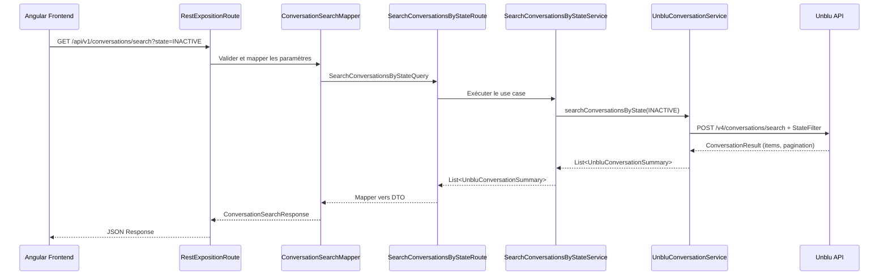

# Plan : Recherche des Conversations Inactives dans Unblu

## 📋 Objectif

Implémenter une fonctionnalité permettant de rechercher les conversations Unblu ayant le statut **INACTIVE** directement
via l'API Unblu (pas dans la base locale).

## 🎯 Contexte

L'application dispose déjà d'une méthode `listAllConversations()` qui récupère toutes les conversations sans filtre.
Nous devons ajouter une recherche filtrée par état pour identifier spécifiquement les conversations inactives.

## 🏗️ Architecture Hexagonale

Le projet suit une architecture hexagonale (ports & adapters) avec les couches suivantes :

```
unblu-domain/          → Modèles métier purs
unblu-application/     → Use cases et orchestration (Camel)
unblu-infrastructure/  → Adapters (Unblu SDK, BDD)
unblu-exposition/      → API REST (Camel REST DSL)
unblu-frontend/        → Interface Angular
```

## 📊 États de Conversation Unblu

D'après le SDK Unblu v4, les états possibles sont définis dans l'enum `EConversationState` :

- **ONBOARDING** : Conversation en cours de création
- **ACTIVE** : Conversation active avec échanges en cours
- **INACTIVE** : Conversation sans activité récente (cible de notre recherche)
- **ENDED** : Conversation terminée
- **OFFBOARDING** : Conversation en cours de clôture

## 🔄 Flux de Données



## 📝 Plan d'Implémentation Détaillé

### Phase 1 : Couche Infrastructure (Adapter Unblu)

#### 1.1 Ajouter la méthode de recherche filtrée dans `UnbluConversationService`

**Fichier** :
`unblu-infrastructure/src/main/java/org/dbs/poc/unblu/infrastructure/adapter/unblu/UnbluConversationService.java`

**Nouvelle méthode** :

```java
/**
 * Recherche les conversations Unblu filtrées par état.
 * Utilise l'API de recherche avec un filtre ConversationStateConversationSearchFilter.
 *
 * @param state l'état de conversation recherché (INACTIVE, ENDED, ACTIVE, etc.)
 * @return liste paginée des conversations correspondantes
 * @throws UnbluApiException en cas d'erreur API
 */
public List<UnbluConversationSummary> searchConversationsByState(String state) {
    // Implémentation avec ConversationQuery + ConversationStateConversationSearchFilter
    // Pagination similaire à listAllConversations()
}
```

**Détails techniques** :

- Utiliser `ConversationQuery` avec `searchFilters`
- Créer un `ConversationStateConversationSearchFilter` avec `EConversationState.valueOf(state)`
- Gérer la pagination (PAGE_SIZE = 100)
- Mapper vers `UnbluConversationSummary` via `toConversationSummary()`

### Phase 2 : Couche Domaine

#### 2.1 Créer le modèle de filtre (optionnel)

**Fichier** : `unblu-domain/src/main/java/org/dbs/poc/unblu/domain/model/ConversationStateFilter.java`

```java
/**
 * Value object représentant un filtre de recherche par état de conversation.
 */
public record ConversationStateFilter(String state) {
    public ConversationStateFilter {
        Objects.requireNonNull(state, "Conversation state cannot be null");
    }
    
    public boolean isInactive() {
        return "INACTIVE".equals(state);
    }
}
```

### Phase 3 : Couche Application (Use Cases)

#### 3.1 Créer le Use Case

**Fichier** :
`unblu-application/src/main/java/org/dbs/poc/unblu/application/port/in/SearchConversationsByStateUseCase.java`

```java
/**
 * Port d'entrée pour la recherche de conversations par état.
 */
public interface SearchConversationsByStateUseCase {
    List<UnbluConversationSummary> searchByState(SearchConversationsByStateQuery query);
}
```

#### 3.2 Créer la Query

**Fichier** :
`unblu-application/src/main/java/org/dbs/poc/unblu/application/port/in/SearchConversationsByStateQuery.java`

```java
/**
 * Query pour la recherche de conversations par état.
 *
 * @param state l'état recherché (INACTIVE, ENDED, ACTIVE, etc.)
 */
public record SearchConversationsByStateQuery(String state) {
    public SearchConversationsByStateQuery {
        Objects.requireNonNull(state, "State cannot be null");
    }
}
```

#### 3.3 Implémenter le Service

**Fichier** :
`unblu-application/src/main/java/org/dbs/poc/unblu/application/service/SearchConversationsByStateService.java`

```java
@Slf4j
@Service
@RequiredArgsConstructor
public class SearchConversationsByStateService implements SearchConversationsByStateUseCase {
    
    private final UnbluPort unbluPort;
    
    @Override
    public List<UnbluConversationSummary> searchByState(SearchConversationsByStateQuery query) {
        log.info("Recherche de conversations avec état: {}", query.state());
        return unbluPort.searchConversationsByState(query.state());
    }
}
```

#### 3.4 Créer la Route Camel

**Fichier** :
`unblu-application/src/main/java/org/dbs/poc/unblu/application/service/SearchConversationsByStateRoute.java`

```java
@Component
public class SearchConversationsByStateRoute extends RouteBuilder {
    
    private final SearchConversationsByStateUseCase searchUseCase;
    
    @Override
    public void configure() {
        from(OrchestratorEndpoints.DIRECT_SEARCH_CONVERSATIONS_BY_STATE)
            .routeId("search-conversations-by-state")
            .log("Recherche de conversations par état: ${header.state}")
            .process(exchange -> {
                String state = exchange.getIn().getHeader("state", String.class);
                SearchConversationsByStateQuery query = new SearchConversationsByStateQuery(state);
                List<UnbluConversationSummary> result = searchUseCase.searchByState(query);
                exchange.getIn().setBody(result);
            })
            .log("Trouvé ${body.size} conversation(s) avec état ${header.state}");
    }
}
```

#### 3.5 Ajouter l'endpoint dans OrchestratorEndpoints

**Fichier** : `unblu-application/src/main/java/org/dbs/poc/unblu/application/service/OrchestratorEndpoints.java`

```java
public static final String DIRECT_SEARCH_CONVERSATIONS_BY_STATE = "direct:search-conversations-by-state";
```

### Phase 4 : Couche Exposition (API REST)

#### 4.1 Créer le DTO de réponse

**Fichier** : `unblu-exposition/src/main/java/org/dbs/poc/unblu/exposition/rest/dto/ConversationSearchResponse.java`

```java
@Value
@Builder
public class ConversationSearchResponse {
    List<ConversationSearchItemResponse> conversations;
    int totalCount;
    String searchedState;
}

@Value
@Builder
class ConversationSearchItemResponse {
    String conversationId;
    String topic;
    String state;
    String createdAt;
    String endedAt;
}
```

#### 4.2 Créer le Mapper

**Fichier** : `unblu-exposition/src/main/java/org/dbs/poc/unblu/exposition/rest/mapper/ConversationSearchMapper.java`

```java
@Component
@RequiredArgsConstructor
public class ConversationSearchMapper {
    
    public void mapSummariesToResponse(Exchange exchange) {
        @SuppressWarnings("unchecked")
        List<UnbluConversationSummary> summaries = exchange.getIn().getBody(List.class);
        String state = exchange.getIn().getHeader("state", String.class);
        
        List<ConversationSearchItemResponse> items = summaries.stream()
            .map(this::toItemResponse)
            .toList();
            
        ConversationSearchResponse response = ConversationSearchResponse.builder()
            .conversations(items)
            .totalCount(items.size())
            .searchedState(state)
            .build();
            
        exchange.getIn().setBody(response);
    }
    
    private ConversationSearchItemResponse toItemResponse(UnbluConversationSummary summary) {
        return ConversationSearchItemResponse.builder()
            .conversationId(summary.id())
            .topic(summary.topic())
            .state(summary.state())
            .createdAt(summary.createdAt().toString())
            .endedAt(summary.endedAt() != null ? summary.endedAt().toString() : null)
            .build();
    }
}
```

#### 4.3 Ajouter l'endpoint REST

**Fichier** : `unblu-exposition/src/main/java/org/dbs/poc/unblu/exposition/rest/RestExpositionRoute.java`

**Dans `defineConversationEndpoints()` :**

```java
.get("/search")
    .description("Recherche de conversations par état")
    .outType(ConversationSearchResponse.class)
    .param()
        .name("state").type(RestParamType.query)
        .required(true)
        .description("État recherché : INACTIVE, ENDED, ACTIVE, ONBOARDING, OFFBOARDING")
    .endParam()
    .to(DIRECT_REST_SEARCH_CONVERSATIONS_BY_STATE)
```

**Dans `defineConversationRoutes()` :**

```java
from(DIRECT_REST_SEARCH_CONVERSATIONS_BY_STATE)
    .routeId(ROUTE_REST_SEARCH_CONVERSATIONS_BY_STATE)
    .log("Recherche de conversations avec état: ${header.state}")
    .to(OrchestratorEndpoints.DIRECT_SEARCH_CONVERSATIONS_BY_STATE)
    .process(conversationSearchMapper::mapSummariesToResponse)
    .log("Retour de ${body.totalCount} conversation(s)");
```

### Phase 5 : Frontend Angular

#### 5.1 Ajouter le modèle TypeScript

**Fichier** : `unblu-frontend/src/app/models/conversation-search.model.ts`

```typescript
export interface ConversationSearchResponse {
  conversations: ConversationSearchItem[];
  totalCount: number;
  searchedState: string;
}

export interface ConversationSearchItem {
  conversationId: string;
  topic: string;
  state: string;
  createdAt: string;
  endedAt?: string;
}

export enum ConversationState {
  ONBOARDING = 'ONBOARDING',
  ACTIVE = 'ACTIVE',
  INACTIVE = 'INACTIVE',
  ENDED = 'ENDED',
  OFFBOARDING = 'OFFBOARDING'
}
```

#### 5.2 Ajouter la méthode dans le service API

**Fichier** : `unblu-frontend/src/app/services/api.service.ts`

```typescript
searchConversationsByState(state: ConversationState): Observable<ConversationSearchResponse> {
  return this.http.get<ConversationSearchResponse>(
    `${this.apiUrl}/conversations/search`,
    { params: { state } }
  );
}
```

#### 5.3 Créer ou mettre à jour le composant

**Option A** : Ajouter un filtre dans le composant existant `conversation-history`

**Option B** : Créer un nouveau composant dédié `inactive-conversations`

**Fichier** : `unblu-frontend/src/app/components/inactive-conversations/inactive-conversations.component.ts`

```typescript
@Component({
  selector: 'app-inactive-conversations',
  templateUrl: './inactive-conversations.component.html',
  styleUrls: ['./inactive-conversations.component.css']
})
export class InactiveConversationsComponent implements OnInit {
  conversations: ConversationSearchItem[] = [];
  loading = false;
  selectedState: ConversationState = ConversationState.INACTIVE;
  
  constructor(private apiService: ApiService) {}
  
  ngOnInit(): void {
    this.searchConversations();
  }
  
  searchConversations(): void {
    this.loading = true;
    this.apiService.searchConversationsByState(this.selectedState)
      .subscribe({
        next: (response) => {
          this.conversations = response.conversations;
          this.loading = false;
        },
        error: (error) => {
          console.error('Erreur lors de la recherche:', error);
          this.loading = false;
        }
      });
  }
}
```

### Phase 6 : Documentation

#### 6.1 Mettre à jour la documentation API

**Fichier** : `docs/UNBLU_API_REFERENCE.md`

Ajouter une section sur le nouvel endpoint de recherche avec exemples de requêtes/réponses.

#### 6.2 Créer la documentation de la fonctionnalité

**Fichier** : `docs/unblu-adapter-doc/search-conversations.md`

Documenter :

- Les états de conversation disponibles
- Les cas d'usage
- Les exemples d'appels API
- Les diagrammes de séquence

## 🧪 Tests à Réaliser

### Tests Unitaires

1. **UnbluConversationService.searchConversationsByState()**
    - Test avec état INACTIVE
    - Test avec pagination
    - Test avec état invalide
    - Test de gestion d'erreur API

2. **SearchConversationsByStateService**
    - Test du use case avec mock du port

3. **ConversationSearchMapper**
    - Test de mapping des summaries vers DTO
    - Test avec liste vide
    - Test avec endedAt null

### Tests d'Intégration

1. **Route Camel complète**
    - Test end-to-end de la route
    - Test avec différents états

2. **API REST**
    - Test GET /api/v1/conversations/search?state=INACTIVE
    - Test avec état invalide (400 Bad Request)
    - Test sans paramètre state (400 Bad Request)

### Tests Frontend

1. **ApiService**
    - Test de l'appel HTTP avec paramètres
    - Test de gestion d'erreur

2. **Composant**
    - Test d'affichage des conversations
    - Test du filtre par état
    - Test de l'état de chargement

## 📦 Livrables

- [ ] Code backend (Infrastructure, Application, Exposition)
- [ ] Code frontend (Service, Composant, Template)
- [ ] Tests unitaires et d'intégration
- [ ] Documentation technique mise à jour
- [ ] Documentation utilisateur (si nécessaire)

## ⚠️ Points d'Attention

1. **Validation des états** : S'assurer que seuls les états valides d'Unblu sont acceptés
2. **Pagination** : Gérer correctement la pagination pour les grandes listes
3. **Performance** : Monitorer les temps de réponse de l'API Unblu
4. **Gestion d'erreurs** : Gérer les cas où l'API Unblu est indisponible
5. **Sécurité** : Valider les paramètres d'entrée côté backend

## 🔄 Évolutions Futures Possibles

1. **Filtres multiples** : Permettre de combiner plusieurs critères (état + date + topic)
2. **Tri personnalisé** : Ajouter des options de tri (date, topic, etc.)
3. **Export** : Permettre l'export des résultats en CSV/Excel
4. **Statistiques** : Afficher des statistiques sur les conversations inactives
5. **Actions groupées** : Permettre des actions sur plusieurs conversations (archivage, suppression)

## 📅 Estimation

- **Phase 1-2 (Infrastructure + Domaine)** : 2-3 heures
- **Phase 3 (Application)** : 2-3 heures
- **Phase 4 (Exposition)** : 1-2 heures
- **Phase 5 (Frontend)** : 2-3 heures
- **Phase 6 (Documentation + Tests)** : 2-3 heures

**Total estimé** : 9-14 heures de développement

---

**Auteur** : IBM Bob  
**Date** : 2026-03-24  
**Version** : 1.0