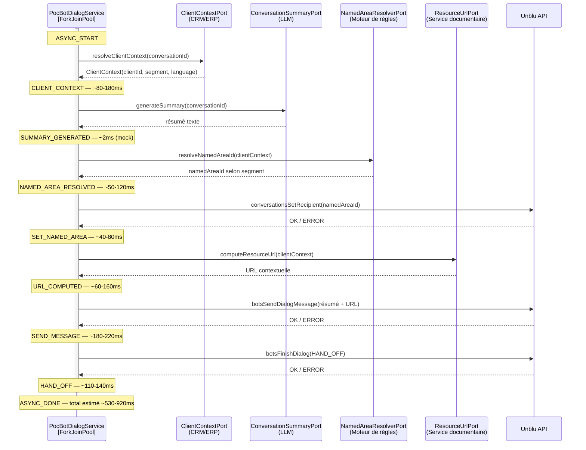
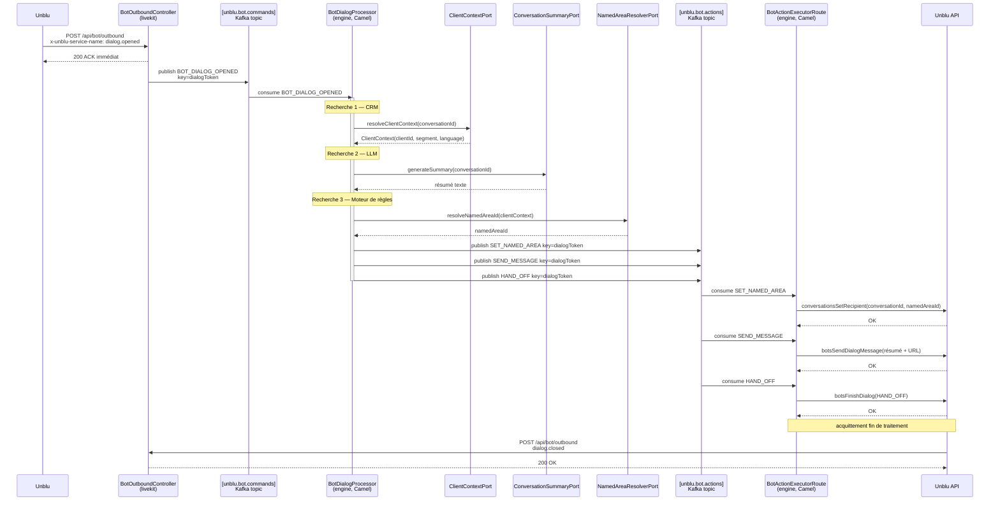

# PocBotDialogService — Comportement et orchestration

## Rôle

`PocBotDialogService` est le cœur du bot Unblu dans le module `livekit`.
Il est déclenché par les événements outbound Unblu (via `BotOutboundController`) et orchestre,
de façon **asynchrone**, une séquence d'appels vers des systèmes externes avant de rendre la main
à un agent humain.

---

## Flux principal — `dialog.opened`

Lorsqu'Unblu notifie l'ouverture d'un dialog bot, `BotOutboundController` retourne un **ACK immédiat**
à Unblu (< 4ms) et délègue le traitement à `PocBotDialogService` sur un thread du `ForkJoinPool`.

```
Unblu → BotOutboundController → ACK immédiat
                              ↘ PocBotDialogService.onDialogOpened() [async]
```

### Séquence des étapes asynchrones



---

## Description des étapes

### Étape 1 — Résolution du contexte client (`ClientContextPort`)

**But :** identifier qui est le client pour les étapes suivantes.  
**Entrée :** `conversationId`  
**Sortie :** `ClientContext(clientId, segment, language)`  
**Mock :** `ClientContextMockAdapter` — dérive un `clientId` depuis le `conversationId`,
tire aléatoirement un segment (`VIP`, `PREMIUM`, `STANDARD`) et une langue (`fr`, `en`, `de`).  
**Latence simulée :** 80–180ms  
**Système réel cible :** CRM / ERP

---

### Étape 2 — Génération du résumé (`ConversationSummaryPort`)

**But :** produire un résumé de la demande client à destination du conseiller.  
**Entrée :** `conversationId`  
**Sortie :** texte libre (2 phrases)  
**Mock :** `ConversationSummaryMockAdapter` — combine aléatoirement deux phrases prédéfinies.
Protégé par un `@CircuitBreaker(name = "summary")`.  
**Latence simulée :** < 5ms  
**Système réel cible :** LLM (ex. Claude API)

---

### Étape 3 — Résolution du named area (`NamedAreaResolverPort`)

**But :** déterminer la file d'attente / l'équipe Unblu cible en fonction du segment client.  
**Entrée :** `ClientContext`  
**Sortie :** `namedAreaId` (identifiant Unblu)  
**Mock :** `NamedAreaResolverMockAdapter` — applique une table de correspondance :

| Segment | Named area |
|---|---|
| VIP | `named-area-vip-desk` |
| PREMIUM | `named-area-premium-desk` |
| STANDARD | `named-area-standard-desk` |

**Latence simulée :** 50–120ms  
**Système réel cible :** moteur de règles métier

#### Positionnement dans Unblu

Immédiatement après la résolution, le service appelle `conversationsSetRecipient()` sur l'API Unblu
pour router la conversation vers le bon desk.

```
Unblu API : conversationsSetRecipient(conversationId, namedAreaId)
```

---

### Étape 4 — Calcul de l'URL contextuelle (`ResourceUrlPort`)

**But :** générer un lien vers la fiche client ou le document pertinent, à envoyer au visiteur.  
**Entrée :** `ClientContext`  
**Sortie :** URL sous la forme `https://client-portal.example.com/clients/{clientId}/conversations/{conversationId}?segment=...&lang=...`  
**Mock :** `ResourceUrlMockAdapter` — construit l'URL à partir des données du contexte client.  
**Latence simulée :** 60–160ms  
**Système réel cible :** service de gestion documentaire / portail client

#### Envoi au visiteur

L'URL est concaténée au résumé LLM dans un seul message envoyé via `botsSendDialogMessage()` :

```
<résumé>

Votre espace personnel : <url>
```

---

### Étape 5 — Transfert vers les agents (`HAND_OFF`)

**But :** fermer le dialog bot et remettre la conversation dans la file des agents.  
**Appel :** `botsFinishDialog(reason = HAND_OFF)`  
**Effet :** Unblu déclenche immédiatement un événement `dialog.closed` (+3–10ms).

---

## Autres événements traités

| Événement Unblu | Comportement |
|---|---|
| `onboarding_offer` | Accepté systématiquement (`offerAccepted=true`) |
| `reboarding_offer` | Accepté systématiquement |
| `offboarding_offer` | Accepté systématiquement |
| `dialog.message` | Ignoré si `senderType ≠ VISITOR` (filtre les échos bot) |
| `dialog.closed` | Log uniquement |

---

## Traçage — tags de log

Tous les logs de ce service utilisent des tags structurés `key=value` pour faciliter l'analyse.

| Tag | Émetteur | Signification |
|---|---|---|
| `[BOT_TRACE]` | `PocBotDialogService` | Étape du flux async avec `correlationId` et `durationMs` |
| `[BOT_EVENT]` | `BotOutboundController` | Réception et dispatch d'un event Unblu |
| `[CONV_TRACE]` | `LiveKitConversationService` | Étapes de la création de conversation |
| `[EXT_TRACE]` | Mocks adaptateurs | Résultat retourné par le système externe simulé |

### Exemple de séquence de logs nominale

```
[BOT_EVENT]  correlationId=f9513be7 event=dialog.opened dialogToken=... conversationId=...
[BOT_TRACE]  step=ASYNC_START       correlationId=f9513be7 ...
[EXT_TRACE]  step=CRM_RESOLVED      conversationId=... clientId=... segment=VIP language=fr
[BOT_TRACE]  step=CLIENT_CONTEXT    correlationId=f9513be7 segment=VIP language=fr durationMs=143
[EXT_TRACE]  step=LLM_SUMMARY       conversationId=...
[BOT_TRACE]  step=SUMMARY_GENERATED correlationId=f9513be7 summaryLength=131 durationMs=2
[EXT_TRACE]  step=NAMED_AREA_RESOLVED conversationId=... namedAreaId=named-area-vip-desk
[BOT_TRACE]  step=NAMED_AREA_RESOLVED correlationId=f9513be7 namedAreaId=named-area-vip-desk durationMs=87
[BOT_TRACE]  step=SET_NAMED_AREA    correlationId=f9513be7 status=OK durationMs=52
[EXT_TRACE]  step=URL_COMPUTED      conversationId=... url=https://client-portal.example.com/...
[BOT_TRACE]  step=URL_COMPUTED      correlationId=f9513be7 url=... durationMs=112
[BOT_TRACE]  step=SEND_MESSAGE      correlationId=f9513be7 status=OK durationMs=196
[BOT_TRACE]  step=HAND_OFF          correlationId=f9513be7 status=OK durationMs=128
[BOT_TRACE]  step=ASYNC_DONE        correlationId=f9513be7 totalDurationMs=720
```

---

## Budget temps estimé (mock)

| Étape | Min | Max | Typique |
|---|---|---|---|
| CRM (`ClientContextPort`) | 80ms | 180ms | ~130ms |
| LLM (`ConversationSummaryPort`) | 0ms | 5ms | ~2ms |
| Moteur de règles (`NamedAreaResolverPort`) | 50ms | 120ms | ~85ms |
| `SET_NAMED_AREA` (Unblu API) | 40ms | 80ms | ~55ms |
| Service documentaire (`ResourceUrlPort`) | 60ms | 160ms | ~110ms |
| `SEND_MESSAGE` (Unblu API) | 180ms | 220ms | ~195ms |
| `HAND_OFF` (Unblu API) | 110ms | 140ms | ~125ms |
| **Total async** | **520ms** | **905ms** | **~700ms** |

En production, le poste dominant sera la génération LLM (cible : < 2s avec streaming).

---

## Remplacement des mocks par les implémentations réelles

Chaque mock implémente une interface port — le remplacement se fait sans modifier le service :

| Port | Mock actuel | Implémentation cible |
|---|---|---|
| `ClientContextPort` | `ClientContextMockAdapter` | Adapter CRM/ERP |
| `ConversationSummaryPort` | `ConversationSummaryMockAdapter` | Adapter Claude API (LLM) |
| `NamedAreaResolverPort` | `NamedAreaResolverMockAdapter` | Adapter moteur de règles |
| `ResourceUrlPort` | `ResourceUrlMockAdapter` | Adapter portail client |

---

## Analyse — Limites de l'architecture actuelle et modèle de référence

### Architecture actuelle du bot (fragile)

```
Unblu outbound
  → BotOutboundController        réception synchrone, ACK immédiat
      → CompletableFuture.runAsync()
          → PocBotDialogService  orchestration async (CRM, LLM, rules, URL, Unblu API)
```

**Problèmes identifiés :**

| Risque | Impact |
|---|---|
| Pas de retry | Si un appel externe échoue (CRM, Unblu API), la séquence est abandonnée silencieusement |
| Pas de persistance | Si le JVM crash pendant le traitement async, l'événement est perdu définitivement |
| Pas de backpressure | Un pic d'événements simultanés sature le ForkJoinPool sans régulation |
| Erreurs silencieuses | `.exceptionally()` logue l'erreur mais aucun mécanisme de reprise |

---

### Modèle de référence existant dans le projet — `webhook-entrypoint` + `engine`

Le projet dispose déjà d'une architecture event-driven robuste pour les webhooks Unblu :

```
Unblu webhook
  → WebhookReceiverController    202 Accepted immédiat
      → Kafka topic: unblu.webhook.events
          → KafkaWebhookConsumerRoute (Camel)
              → direct:webhook-event-processor
                  → WebhookEventRoute (Camel choice sur eventType)
                      → ConversationEventProcessor
                      → PersonEventProcessor
                      → UnknownEventProcessor
```

**Ce que ce modèle apporte :**

| Mécanisme | Bénéfice |
|---|---|
| Kafka entre réception et traitement | Découplage total — le traitement peut être lent sans impacter Unblu |
| `onException` avec retry + backoff | Résilience sur erreurs transitoires (3 tentatives, délai exponentiel) |
| DLQ (`unblu.webhook.events.dlq`) | Les messages non traitables sont parkés avec métadonnées d'erreur |
| Route Camel `choice` sur event type | Même pattern que le `switch` du `BotOutboundController` |

---

### Analogie directe bot ↔ webhook engine

| Rôle | Webhook engine (existant) | Bot actuel | Bot cible |
|---|---|---|---|
| Réception | `WebhookReceiverController` | `BotOutboundController` | `BotOutboundController` (inchangé) |
| Bus d'événements | Kafka `unblu.webhook.events` | `CompletableFuture` | Kafka ou Camel `seda:` |
| Consumer | `KafkaWebhookConsumerRoute` | — | Route Camel consumer |
| Dispatch | `WebhookEventRoute` (choice) | `switch(serviceName)` | Route Camel (choice) |
| Traitement | `ConversationEventProcessor` | `PocBotDialogService` | Processor Camel |
| Résilience | Retry + DLQ | Aucune | Retry + DLQ |

---

### Évolution recommandée

Remplacer le `CompletableFuture.runAsync()` par le même pattern que l'`engine` :

1. `BotOutboundController` publie l'événement sur un topic Kafka (ou `seda:` Camel pour rester in-process)
2. Une route Camel consomme et dispatche par type (`onboarding_offer`, `dialog.opened`, etc.)
3. `PocBotDialogService` devient un `Processor` Camel avec retry et DLQ

Ce refactoring ne change pas les ports ni les mocks — seul le fil conducteur entre réception et exécution change.

---

## Architecture cible — orchestration via Kafka et engine

### Vue d'ensemble

```
Unblu (outbound bot events)
  │  POST /api/bot/outbound
  ▼
BotOutboundController (livekit, port 8082)
  │  ACK immédiat → Unblu
  │  publie commande JSON
  ▼
[unblu.bot.commands]
  │  consomme
  ▼
engine (port 8084, Camel)
  │  BotCommandConsumerRoute
  │  dispatche sur commandType
  ├─ BOT_ONBOARDING_OFFER → accepte (pas d'action Unblu nécessaire)
  └─ BOT_DIALOG_OPENED    → BotDialogProcessor
                               │  Recherche 1 : CRM  → ClientContext
                               │  Recherche 2 : LLM  → résumé
                               │  Recherche 3 : règles → namedAreaId
                               │  publie 3 actions séquentielles
                               ▼
                          [unblu.bot.actions]
                               │  consomme
                               ▼
                          BotActionExecutorRoute (engine, Camel)
                               │  dispatche sur actionType
                               ├─ SET_NAMED_AREA → conversationsSetRecipient()
                               ├─ SEND_MESSAGE   → botsSendDialogMessage()
                               └─ HAND_OFF       → botsFinishDialog(HAND_OFF)
                                                    └─ acquitte la fin de traitement
                                                       → Unblu ferme le dialog (dialog.closed)
```

---

### Séquence détaillée



---

### Routes Camel à créer dans `engine`

#### `BotCommandConsumerRoute` — consomme `unblu.bot.commands`

```
kafka:unblu.bot.commands
  → désérialise BotCommand
  → choice sur commandType
      BOT_ONBOARDING_OFFER → log + no-op
      BOT_DIALOG_OPENED    → direct:bot-dialog-processor
      default              → log warn
```

#### `BotDialogProcessor` — réalise les 3 recherches

```
direct:bot-dialog-processor
  → ClientContextPort.resolveClientContext()    [Recherche 1 — CRM]
  → ConversationSummaryPort.generateSummary()   [Recherche 2 — LLM]
  → NamedAreaResolverPort.resolveNamedAreaId()  [Recherche 3 — règles]
  → publie SET_NAMED_AREA sur unblu.bot.actions
  → publie SEND_MESSAGE   sur unblu.bot.actions
  → publie HAND_OFF       sur unblu.bot.actions
```

#### `BotActionExecutorRoute` — consomme `unblu.bot.actions` et appelle Unblu

```
kafka:unblu.bot.actions
  → désérialise BotAction
  → choice sur actionType
      SET_NAMED_AREA → conversationsSetRecipient()
      SEND_MESSAGE   → botsSendDialogMessage()
      HAND_OFF       → botsFinishDialog(HAND_OFF)  ← acquittement fin de traitement
```

---

### Garanties apportées par ce design

| Propriété | Mécanisme |
|---|---|
| **Ordre des actions** | Même clé `dialogToken` → même partition → ordre garanti SET_NAMED_AREA → SEND_MESSAGE → HAND_OFF |
| **Retry sur erreur Unblu API** | `onException` Camel avec backoff exponentiel sur `BotActionExecutorRoute` |
| **Pas de perte d'événement** | Kafka persiste les messages — un redémarrage engine reprend là où il s'est arrêté |
| **ACK immédiat à Unblu** | `BotOutboundController` répond avant même que le message soit traité |
| **DLQ** | Actions non exécutables après retry → `unblu.bot.actions.dlq` |
| **HAND_OFF = acquittement** | Dernier message publié sur `unblu.bot.actions` — ferme le dialog côté Unblu |

---

### Messages Kafka

**`unblu.bot.commands`** — clé : `dialogToken`

```json
{
  "commandType": "BOT_DIALOG_OPENED",
  "correlationId": "f231180c",
  "dialogToken": "qsfFvt94R2O6xYOKNQ3Qrw-c-Qt8DWI...",
  "conversationId": "qsfFvt94R2O6xYOKNQ3Qrw",
  "timestamp": "2026-04-26T19:52:29.477Z"
}
```

**`unblu.bot.actions`** — clé : `dialogToken`

```json
{ "actionType": "SET_NAMED_AREA", "correlationId": "f231180c",
  "conversationId": "qsfFvt94R2O6xYOKNQ3Qrw",
  "payload": { "namedAreaId": "ZvcLavqFTKC65YtiRKtJxg" } }

{ "actionType": "SEND_MESSAGE", "correlationId": "f231180c",
  "dialogToken": "qsfFvt94R2O6xYOKNQ3Qrw-c-Qt8DWI...",
  "payload": { "text": "Résumé...\n\nVotre espace : https://..." } }

{ "actionType": "HAND_OFF", "correlationId": "f231180c",
  "dialogToken": "qsfFvt94R2O6xYOKNQ3Qrw-c-Qt8DWI...",
  "payload": { "reason": "HAND_OFF" } }
```

> Voir `docs/KAFKA_TOPICS_DESIGN.md` pour le détail complet des topics et formats.
