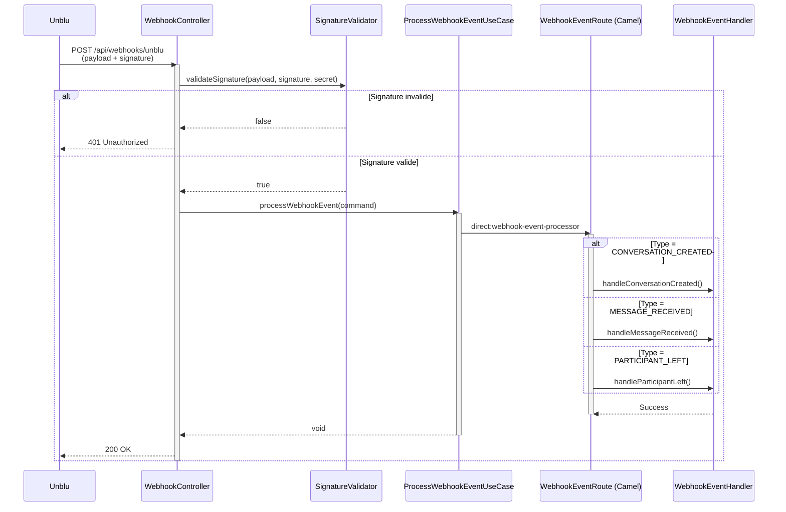

# Plan d'implémentation du service webhook Unblu

## 📋 Vue d'ensemble

Implémentation d'un service pour répondre aux événements webhook d'Unblu en suivant l'architecture hexagonale (ports & adapters) existante et l'orchestration Apache Camel.

---

## 🎯 Types d'événements Unblu disponibles (SDK v4 - 8.30.1)

### Événements Conversation
- `ConversationCreatedEvent` - Conversation créée
- `ConversationEndedEvent` - Conversation terminée
- `ConversationActiveEvent` - Conversation activée
- `ConversationOnboardingEvent` - Début d'onboarding
- `ConversationRequeuedEvent` - Conversation remise en file d'attente
- `ConversationRecordingStartedEvent` - Enregistrement démarré

### Événements Message
- `ConversationMessageStateEvent` - État du message modifié
- `ConversationMessageTranslatedEvent` - Message traduit
- `BotDialogMessageEvent` - Message de bot
- `ExternalMessengerNewMessageEvent` - Nouveau message externe
- `ExternalMessengerMessageStateEvent` - État message externe

### Événements Participant
- `ParticipationActivatedEvent` - Participant activé
- `ParticipationLeftEvent` - Participant quitté
- `CallParticipantJoinedEvent` - Participant rejoint appel

### Événements Résumé
- `ConversationSummaryGeneratedEvent` - Résumé généré
- `ConversationSummaryFailedEvent` - Échec génération résumé
- `ConversationSummaryRejectedEvent` - Résumé rejeté

### Événements Invitation/Agent
- `AgentInvitationCreatedEvent` - Invitation agent créée
- `AgentInvitationRevokedEvent` - Invitation agent révoquée
- `AgentForwardingCreatedEvent` - Transfert agent créé

### Événements Système
- `WebhookAuditEvent` - Audit webhook
- `WebhookExpiredEvent` - Webhook expiré
- `WebhookPingEvent` - Ping webhook (test)

---

## 🏗️ Architecture proposée

### 1. **Domain Layer** (`unblu-domain`)

#### Modèles métier
```
unblu-domain/src/main/java/org/dbs/poc/unblu/domain/model/webhook/
├── WebhookEvent.java (classe abstraite)
├── WebhookEventType.java (enum)
├── ConversationWebhookEvent.java (record)
├── MessageWebhookEvent.java (record)
├── ParticipantWebhookEvent.java (record)
└── SystemWebhookEvent.java (record)
```

**WebhookEventType** (enum) :
- CONVERSATION_CREATED
- CONVERSATION_ENDED
- MESSAGE_RECEIVED
- PARTICIPANT_JOINED
- PARTICIPANT_LEFT
- WEBHOOK_PING
- etc.

#### Port secondaire
```
unblu-domain/src/main/java/org/dbs/poc/unblu/domain/port/secondary/
└── WebhookEventPort.java (interface)
```

**Méthode** : `void handleEvent(WebhookEvent event)`

---

### 2. **Application Layer** (`unblu-application`)

#### Port IN (Use Case)
```
unblu-application/src/main/java/org/dbs/poc/unblu/application/port/in/
├── ProcessWebhookEventUseCase.java (interface)
└── WebhookEventCommand.java (record)
```

#### Service & Route Camel
```
unblu-application/src/main/java/org/dbs/poc/unblu/application/service/
├── WebhookEventProcessor.java (service)
└── WebhookEventRoute.java (route Camel)
```

**Route Camel** : `direct:webhook-event-processor`
- Reçoit un `WebhookEventCommand`
- Route selon le type d'événement (Content-Based Router pattern)
- Appelle les adapters spécifiques via `WebhookEventPort`

---

### 3. **Infrastructure Layer** (`unblu-infrastructure`)

#### Adapter
```
unblu-infrastructure/src/main/java/org/dbs/poc/unblu/infrastructure/adapter/webhook/
├── WebhookEventHandler.java (adapter Camel)
└── WebhookSignatureValidator.java (validation sécurité)
```

#### Extension UnbluService
Ajouter dans `UnbluService.java` :
```java
// Enregistrer un webhook
public WebhookRegistration registerWebhook(String name, String endpoint, List<String> eventTypes)

// Mettre à jour un webhook
public WebhookRegistration updateWebhook(String id, WebhookRegistration data)

// Supprimer un webhook
public void deleteWebhook(String id)

// Tester un webhook (ping)
public void pingWebhook(String id)
```

#### Configuration
Ajouter dans `UnbluProperties.java` :
```java
private WebhookProperties webhook = new WebhookProperties();

@Data
public static class WebhookProperties {
    private String endpoint;        // URL publique (ex: https://mon-app.com/api/webhooks/unblu)
    private String secret;           // Secret partagé pour validation signature
    private boolean validateSignature = true;
    private List<String> enabledEvents = new ArrayList<>();
}
```

---

### 4. **Exposition Layer** (`unblu-exposition`)

#### Controller REST
```
unblu-exposition/src/main/java/org/dbs/poc/unblu/exposition/rest/
└── WebhookController.java
```

**Endpoint** : `POST /api/webhooks/unblu`

**Headers attendus** :
- `X-Unblu-Signature` : Signature HMAC-SHA256 du payload
- `X-Unblu-Event-Type` : Type d'événement

**Flow** :
1. Validation de la signature (sécurité)
2. Parsing du payload JSON → `WebhookEventCommand`
3. Appel du use case `ProcessWebhookEventUseCase`
4. Retour HTTP 200 OK (ou 400/401 en cas d'erreur)

#### DTO
```
unblu-exposition/src/main/java/org/dbs/poc/unblu/exposition/rest/dto/
├── WebhookPayload.java (record générique)
└── UnbluWebhookRequest.java (record)
```

---

## 🔐 Sécurité : Validation de signature

### ⚠️ POINT À APPROFONDIR

**Question** : Comment Unblu signe-t-il les webhooks ?
- Quel algorithme ? (HMAC-SHA256, HMAC-SHA512, autre ?)
- Quel header contient la signature ? (`X-Unblu-Signature`, `X-Webhook-Signature` ?)
- Format de la signature ? (hex, base64 ?)
- Le secret est-il configuré côté Unblu lors de l'enregistrement du webhook ?

**À vérifier dans la documentation Unblu** :
- https://docs.unblu.com/latest/knowledge-base/integration/web-api-webhooks/webhooks-technical-detail.html
- SDK Unblu : rechercher des classes comme `WebhookSignature`, `WebhookValidation`
- Tester avec un webhook de test (ping event)

**Implémentation provisoire** :
```java
public class WebhookSignatureValidator {

    public boolean validateSignature(String payload, String receivedSignature, String secret) {
        // TODO: Implémenter selon la doc Unblu
        // Exemple générique HMAC-SHA256 :
        String expectedSignature = computeHmacSha256(payload, secret);
        return MessageDigest.isEqual(
            expectedSignature.getBytes(),
            receivedSignature.getBytes()
        );
    }

    private String computeHmacSha256(String data, String secret) {
        // Implémentation HMAC-SHA256
        // ...
    }
}
```

---

## 📦 Configuration (.env + application.properties)

### `.env`
```properties
# Webhook configuration
UNBLU_WEBHOOK_ENDPOINT=https://mon-app.ngrok.io/api/webhooks/unblu
UNBLU_WEBHOOK_SECRET=super-secret-shared-key-12345
UNBLU_WEBHOOK_VALIDATE_SIGNATURE=true
UNBLU_WEBHOOK_ENABLED_EVENTS=CONVERSATION.CREATED,CONVERSATION.ENDED,MESSAGE.STATE_CHANGED
```

### `application.properties`
```properties
unblu.api.webhook.endpoint=${UNBLU_WEBHOOK_ENDPOINT}
unblu.api.webhook.secret=${UNBLU_WEBHOOK_SECRET}
unblu.api.webhook.validate-signature=${UNBLU_WEBHOOK_VALIDATE_SIGNATURE:true}
unblu.api.webhook.enabled-events=${UNBLU_WEBHOOK_ENABLED_EVENTS}
```

---

## 🔄 Workflow de traitement d'un webhook



---

## 📝 Endpoints Camel à créer

| Endpoint                                  | Description                          | Type     |
|-------------------------------------------|--------------------------------------|----------|
| `direct:webhook-event-processor`          | Point d'entrée traitement webhook    | Route    |
| `direct:webhook-handle-conversation`      | Traitement événements conversation   | Handler  |
| `direct:webhook-handle-message`           | Traitement événements message        | Handler  |
| `direct:webhook-handle-participant`       | Traitement événements participant    | Handler  |
| `direct:webhook-handle-system`            | Traitement événements système        | Handler  |

---

## 🧪 Plan de tests

### 1. Test du webhook ping
- Enregistrer un webhook de test
- Déclencher un ping depuis Unblu
- Vérifier la réception et la signature

### 2. Test création conversation
- Créer une conversation via l'API existante (`POST /api/conversations/team`)
- Vérifier la réception de l'événement `CONVERSATION_CREATED`
- Logger les détails de l'événement

### 3. Test message reçu
- Envoyer un message dans une conversation
- Vérifier la réception de l'événement `MESSAGE_RECEIVED`

### 4. Test validation signature
- Envoyer un webhook avec signature invalide → 401
- Envoyer un webhook avec signature valide → 200

---

## 📚 Références

- **SDK Unblu v4** : Classes déjà importées dans `UnbluService.java:10` (`WebhookRegistrationsApi`)
- **Méthodes existantes** : `UnbluService.java:372-445` (search, getById, getByName)
- **Architecture actuelle** : `docs/ARCHITECTURE_ET_WORKFLOWS.md`
- **API Unblu** : https://services8.unblu.com/app/rest/v4 (base URL)

---

## 🌐 Exposition de l'application locale (Freebox Ultra)

Pour recevoir les webhooks Unblu, votre application doit être accessible depuis Internet. Voici les options disponibles :

---

### Option 1 : **Ngrok** (⭐ Recommandé pour le développement)

**Installation** :
```bash
# macOS
brew install ngrok

# Linux
curl -s https://ngrok-agent.s3.amazonaws.com/ngrok.asc | sudo tee /etc/apt/trusted.gpg.d/ngrok.asc >/dev/null
echo "deb https://ngrok-agent.s3.amazonaws.com buster main" | sudo tee /etc/apt/sources.list.d/ngrok.list
sudo apt update && sudo apt install ngrok
```

**Usage** :
```bash
# Terminal 1 : Lancer votre app Spring Boot
./mvnw spring-boot:run

# Terminal 2 : Lancer ngrok
ngrok http 8080

# Vous obtiendrez une URL comme :
# https://abc123.ngrok.io -> http://localhost:8080
```

**⚠️ LIMITATION IMPORTANTE** :
- 🔴 **Avec ngrok gratuit, l'URL change à chaque redémarrage**
- Exemple :
  - Lancement 1 : `https://abc123.ngrok.io`
  - Lancement 2 : `https://xyz789.ngrok.io`
- ❌ Vous devrez **mettre à jour le webhook dans Unblu** à chaque fois
- ✅ **Solution** : Passer à **ngrok Pro** (8$/mois) pour une URL fixe (ex: `https://unblu-webhook.ngrok.io`)

**Interface de debug** :
- URL locale : http://127.0.0.1:4040
- Permet de voir toutes les requêtes HTTP reçues en temps réel

**Configuration dans `.env`** :
```properties
# ⚠️ À METTRE À JOUR à chaque redémarrage de ngrok
UNBLU_WEBHOOK_ENDPOINT=https://abc123.ngrok.io/api/webhooks/unblu
```

---

### Option 2 : **Cloudflare Tunnel** (⭐ URL fixe GRATUITE)

**Installation** :
```bash
# Télécharger cloudflared
curl -L https://github.com/cloudflare/cloudflared/releases/latest/download/cloudflared-linux-amd64 -o cloudflared
chmod +x cloudflared
sudo mv cloudflared /usr/local/bin/

# Authentification (ouvre le navigateur)
cloudflared tunnel login

# Créer un tunnel avec un nom fixe
cloudflared tunnel create unblu-webhook

# Note l'ID du tunnel (ex: 12345678-1234-1234-1234-123456789abc)
```

**Configuration** :
```yaml
# ~/.cloudflared/config.yml
tunnel: 12345678-1234-1234-1234-123456789abc
credentials-file: /home/daniel/.cloudflared/12345678-1234-1234-1234-123456789abc.json

ingress:
  - hostname: unblu-webhook.votre-domaine.com
    service: http://localhost:8080
  - service: http_status:404
```

**Lancer le tunnel** :
```bash
cloudflared tunnel run unblu-webhook
```

**Avantages** :
- ✅ **URL fixe et gratuite** (ex: `https://unblu-webhook.votre-domaine.com`)
- ✅ Pas besoin d'ouvrir de ports sur la Freebox
- ✅ HTTPS automatique (certificat SSL géré par Cloudflare)
- ✅ Logs des requêtes dans le dashboard Cloudflare

---

### Option 3 : **Freebox Ultra - NAT + DynDNS** (Pour production/test persistant)

#### Étape 1 : Configuration du NAT (Port Forwarding)

1. Accéder à l'interface Freebox OS : http://mafreebox.freebox.fr
2. **Paramètres de la Freebox** → **Mode avancé** → **Gestion des ports**
3. Ajouter une redirection :
   - **Port externe** : 8443 (ou 443 si disponible)
   - **Port interne** : 8080 (port Spring Boot)
   - **Protocole** : TCP
   - **IP destination** : IP locale de votre machine (ex: `192.168.1.50`)
   - **Description** : `Unblu Webhook`

#### Étape 2 : Obtenir votre IP locale
```bash
# Linux/macOS
ip addr show | grep "inet " | grep -v 127.0.0.1

# Ou via l'interface Freebox OS :
# Paramètres → Périphériques réseau → [Votre PC]
```

#### Étape 3 : Nom de domaine dynamique

**Option A : DynDNS Freebox intégré**
- La Freebox Ultra offre un nom de domaine automatique :
  - Format : `XXXXXXX.fbxos.fr`
  - **Paramètres** → **Nom de domaine** pour le trouver

**Option B : DuckDNS (Gratuit)**
```bash
# 1. Créer un compte sur https://www.duckdns.org
# 2. Créer un sous-domaine (ex: unblu-webhook.duckdns.org)
# 3. Installer le client DuckDNS

# Script de mise à jour automatique (crontab)
echo url="https://www.duckdns.org/update?domains=unblu-webhook&token=VOTRE_TOKEN&ip=" | curl -k -o ~/duckdns/duck.log -K -

# Ajouter au crontab pour mise à jour toutes les 5 minutes
*/5 * * * * ~/duckdns/duck.sh >/dev/null 2>&1
```

**Configuration Spring Boot** (application.properties) :
```properties
# Écouter sur toutes les interfaces (pas seulement localhost)
server.address=0.0.0.0
server.port=8080

# Configuration SSL (optionnel mais recommandé)
server.ssl.enabled=true
server.ssl.key-store=classpath:keystore.p12
server.ssl.key-store-password=changeit
server.ssl.key-store-type=PKCS12
```

**Configuration `.env`** :
```properties
UNBLU_WEBHOOK_ENDPOINT=https://unblu-webhook.duckdns.org:8443/api/webhooks/unblu
```

---

### Option 4 : **Serveo** (Alternative simple sans installation)

```bash
# Tunnel SSH automatique (pas d'installation nécessaire)
ssh -R 80:localhost:8080 serveo.net

# Avec sous-domaine personnalisé (si disponible)
ssh -R unblu:80:localhost:8080 serveo.net
```

**⚠️ LIMITATION** :
- URL change à chaque connexion (comme ngrok gratuit)
- Moins stable que ngrok/Cloudflare

---

## 📊 Comparaison des solutions

| Solution | URL fixe | Gratuit | Facile | Sécurisé | Recommandation |
|----------|----------|---------|--------|----------|----------------|
| **Ngrok (gratuit)** | ❌ Non | ✅ Oui | ✅✅✅ | ✅✅ | 🟡 Dev uniquement |
| **Ngrok Pro** | ✅ Oui | ❌ 8$/mois | ✅✅✅ | ✅✅ | 🟢 Dev/Test |
| **Cloudflare Tunnel** | ✅ Oui | ✅ Oui | ✅✅ | ✅✅✅ | 🟢 Meilleur choix |
| **Freebox NAT + DynDNS** | ✅ Oui | ✅ Oui | ✅ | ✅ | 🟢 Production |
| **Serveo** | ❌ Non | ✅ Oui | ✅✅✅ | ⚠️ | 🔴 Test rapide |

---

## 🎯 Recommandation finale

### Pour votre PoC :
1. **Court terme (tests rapides)** :
   - Utiliser **ngrok gratuit**
   - Accepter de mettre à jour l'URL webhook dans Unblu à chaque redémarrage

2. **Moyen terme (tests intensifs)** :
   - Utiliser **Cloudflare Tunnel** (gratuit + URL fixe)
   - Configuration initiale un peu plus complexe mais URL stable

3. **Long terme (production)** :
   - Configurer **Freebox NAT + DynDNS**
   - Ajouter un certificat SSL (Let's Encrypt)

---

## 🚧 Points bloquants à résoudre

1. **Signature des webhooks** : Algorithme exact et format utilisé par Unblu
2. **Exposition publique** : Choisir entre Cloudflare Tunnel (URL fixe gratuite) ou ngrok (URL change à chaque redémarrage)
3. **Types d'événements** : Liste complète des événements à écouter selon les besoins métier
4. **Gestion des erreurs** : Que faire si le traitement échoue ? Retry ? Dead letter queue ?

---

## 📌 Ordre d'implémentation recommandé

### Phase 0 : Préparation (PRIORITAIRE)
1. ⚠️ **Configurer Cloudflare Tunnel** pour avoir une URL publique fixe
2. ⚠️ **Investiguer la signature webhook Unblu** (algorithme, header, format)
3. ⚠️ **Tester la réception d'un webhook ping** pour valider la config

### Phase 1 : Domain Layer
4. Créer `WebhookEventType` (enum)
5. Créer `WebhookEvent` (classe abstraite)
6. Créer les events spécifiques (`ConversationWebhookEvent`, `MessageWebhookEvent`, etc.)
7. Créer le port secondaire `WebhookEventPort`

### Phase 2 : Application Layer
8. Créer `WebhookEventCommand` (record)
9. Créer l'interface `ProcessWebhookEventUseCase`
10. Créer le service `WebhookEventProcessor`
11. Créer la route Camel `WebhookEventRoute` avec Content-Based Router

### Phase 3 : Infrastructure Layer
12. Créer `WebhookSignatureValidator` (validation HMAC)
13. Créer l'adapter `WebhookEventHandler` (implémente `WebhookEventPort`)
14. Ajouter méthodes dans `UnbluService` :
    - `registerWebhook()`
    - `updateWebhook()`
    - `deleteWebhook()`
    - `pingWebhook()`
15. Ajouter `WebhookProperties` dans `UnbluProperties`
16. Mettre à jour `.env` avec les propriétés webhook

### Phase 4 : Exposition Layer
17. Créer DTOs (`WebhookPayload`, `UnbluWebhookRequest`)
18. Créer `WebhookController` avec endpoint `POST /api/webhooks/unblu`
19. Intégrer validation signature dans le controller

### Phase 5 : Tests
20. Enregistrer un webhook dans Unblu via l'API
21. Déclencher un webhook ping
22. Tester avec événement `CONVERSATION_CREATED`
23. Tester avec événement `MESSAGE_RECEIVED`
24. Valider la sécurité (signature invalide → 401)

---

## 🛠️ Guide de démarrage rapide (Quick Start)

### Jour 1 : Setup infrastructure
```bash
# 1. Installer Cloudflare Tunnel
curl -L https://github.com/cloudflare/cloudflared/releases/latest/download/cloudflared-linux-amd64 -o cloudflared
chmod +x cloudflared
sudo mv cloudflared /usr/local/bin/
cloudflared tunnel login
cloudflared tunnel create unblu-webhook

# 2. Configurer le tunnel (~/.cloudflared/config.yml)
# tunnel: <TUNNEL_ID>
# credentials-file: /home/daniel/.cloudflared/<TUNNEL_ID>.json
# ingress:
#   - hostname: unblu-webhook.votre-domaine.com
#     service: http://localhost:8080
#   - service: http_status:404

# 3. Lancer le tunnel (terminal séparé)
cloudflared tunnel run unblu-webhook

# 4. Tester l'application
./mvnw spring-boot:run
curl https://unblu-webhook.votre-domaine.com/actuator/health
```

### Jour 2-3 : Implémenter le code
- Suivre les phases 1 à 4 ci-dessus
- Commiter régulièrement

### Jour 4 : Tests et intégration
- Enregistrer le webhook dans Unblu
- Tester tous les types d'événements
- Valider la sécurité

---

## 📚 Ressources utiles

### Documentation Unblu
- **API Reference** : https://services8.unblu.com/app/rest/v4 (votre instance)
- **Webhook Documentation** : https://docs.unblu.com/latest/knowledge-base/integration/web-api-webhooks/
- **OpenAPI Spec** : https://unblu.github.io/openapi/

### SDK Unblu (déjà intégré)
- `WebhookRegistrationsApi` : Gestion des webhooks
- `ConversationCreatedEvent`, `ConversationEndedEvent`, etc. : Classes d'événements

### Cloudflare Tunnel
- **Installation** : https://developers.cloudflare.com/cloudflare-one/connections/connect-apps/install-and-setup/
- **Configuration** : https://developers.cloudflare.com/cloudflare-one/connections/connect-apps/configuration/

### Apache Camel
- **Content-Based Router** : https://camel.apache.org/components/latest/eips/content-based-router-eip.html
- **Resilience4j** : https://camel.apache.org/components/latest/eips/resilience4j-eip.html

---

## 🔍 Points d'investigation restants

### 1. Signature webhook Unblu
**À vérifier** :
```bash
# Tester avec un webhook ping pour voir les headers
curl -X POST https://services8.unblu.com/app/rest/v4/webhookregistrations/<ID>/ping \
  -H "Authorization: Bearer <TOKEN>" \
  -u "hb-admin:HbDemo25"
```

**Questions** :
- Header de signature : `X-Unblu-Signature` ? `X-Webhook-Signature` ?
- Algorithme : HMAC-SHA256 ? HMAC-SHA512 ?
- Format : hexadécimal ? base64 ?
- Secret : configuré où ? (lors de l'enregistrement du webhook ?)

### 2. Types d'événements prioritaires
**À décider avec le métier** :
- Quels événements doivent déclencher des actions ?
- Exemple :
  - `CONVERSATION_CREATED` → Créer un ticket CRM ?
  - `MESSAGE_RECEIVED` → Analyser le sentiment ?
  - `CONVERSATION_ENDED` → Envoyer un email de satisfaction ?

### 3. Gestion des erreurs
**Stratégie à définir** :
- Si le traitement échoue, Unblu retry-t-il ?
- Faut-il implémenter une Dead Letter Queue (DLQ) ?
- Logging : niveau de détail nécessaire ?

---

## 🎯 Critères de succès du PoC

### Fonctionnel
- ✅ Recevoir un webhook Unblu via URL publique (Cloudflare Tunnel)
- ✅ Valider la signature pour sécuriser l'endpoint
- ✅ Parser le payload JSON et identifier le type d'événement
- ✅ Router l'événement vers le bon handler (Camel Content-Based Router)
- ✅ Logger les événements reçus avec tous les détails
- ✅ Retourner HTTP 200 OK à Unblu

### Technique
- ✅ Architecture hexagonale respectée (Domain → Application → Infrastructure → Exposition)
- ✅ Orchestration via Apache Camel
- ✅ Configuration externalisée (`.env` + `application.properties`)
- ✅ Code testable (séparation des responsabilités)

### Sécurité
- ✅ Validation signature HMAC obligatoire
- ✅ Rejet des webhooks avec signature invalide (HTTP 401)
- ✅ Secret stocké de manière sécurisée (variable d'environnement)

---

## 📝 Checklist finale avant mise en production

- [ ] URL Cloudflare Tunnel configurée et stable
- [ ] Webhook enregistré dans Unblu avec la bonne URL
- [ ] Secret partagé configuré côté Unblu et côté application
- [ ] Tests de tous les types d'événements (ping, conversation, message)
- [ ] Validation signature activée et testée
- [ ] Logging structuré activé (JSON logs recommandé)
- [ ] Monitoring des webhooks reçus (métriques, alertes)
- [ ] Documentation des handlers implémentés
- [ ] Plan de rollback en cas de problème

---

**Auteur** : Documentation générée lors de l'analyse d'implémentation webhook
**Date** : 2026-03-13
**Version** : 1.0
**Statut** : 📘 **PRÊT À IMPLÉMENTER** - Configuration Cloudflare Tunnel en priorité

**Prochaine étape recommandée** : Installer et configurer Cloudflare Tunnel pour obtenir une URL publique fixe.
