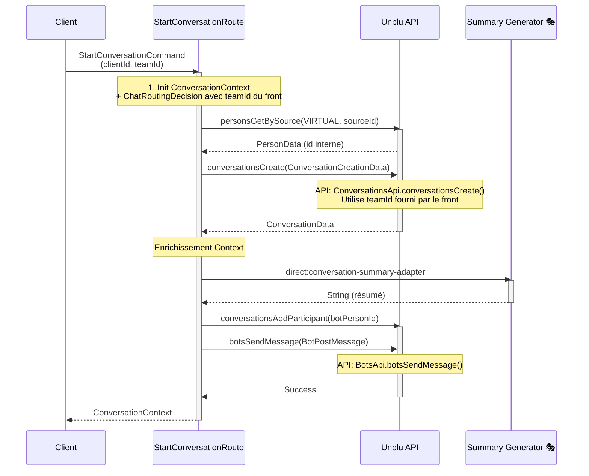
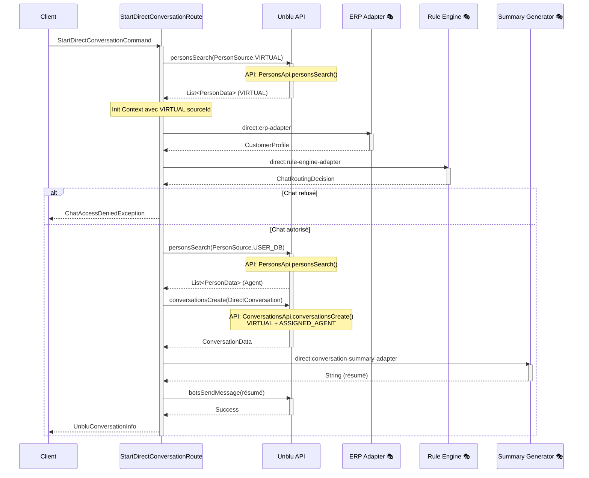
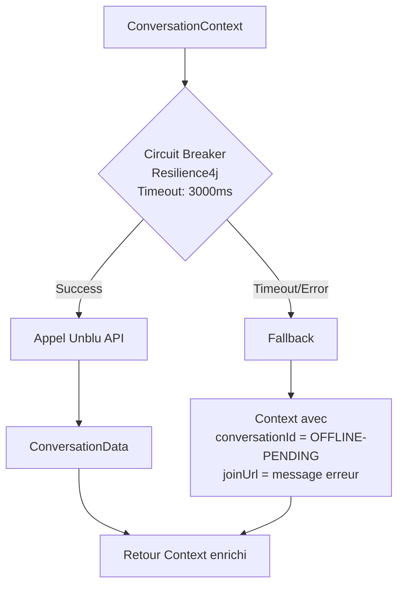

# Workflows - PoC Unblu

## 📋 Table des matières

1. [Workflow 1 : Création de conversation avec équipe](#workflow-1--création-de-conversation-avec-équipe)
2. [Workflow 2 : Création de conversation directe (1-to-1)](#workflow-2--création-de-conversation-directe-1-to-1)
3. [Workflow 3 : Résilience Unblu (Circuit Breaker)](#workflow-3--résilience-unblu-circuit-breaker)
4. [Référence API Unblu](#référence-api-unblu)
5. [Corrections récentes](#corrections-récentes)
6. [Prochaines étapes](#prochaines-étapes)

---

## Workflow 1 : Création de conversation avec équipe

**Endpoint** : `POST /api/conversations/team`

**Flux** :



**APIs Unblu utilisées** :
1. `PersonsApi.personsGetBySource()` - Récupération ID interne personne
2. `ConversationsApi.conversationsCreate()` - Création conversation
3. `ConversationsApi.conversationsAddParticipant()` - Ajout bot
4. `BotsApi.botsSendMessage()` - Envoi résumé

**Changement important** :
- ✅ Le `teamId` est maintenant fourni directement par le front dans `StartConversationCommand`
- ❌ Plus d'appel à l'ERP Mock
- ❌ Plus d'appel au moteur de règles Mock
- ❌ Plus de vérification d'autorisation

📄 Fichier : `unblu-application/src/main/java/org/dbs/poc/unblu/application/service/StartConversationRoute.java`

---

## Workflow 2 : Création de conversation directe (1-to-1)

**Endpoint** : `POST /api/conversations/direct`

**Flux** :



**APIs Unblu utilisées** :
1. `PersonsApi.personsSearch()` - Recherche VIRTUAL et USER_DB
2. `ConversationsApi.conversationsCreate()` - Conversation directe
3. `BotsApi.botsSendMessage()` - Envoi résumé

📄 Fichier : `unblu-application/src/main/java/org/dbs/poc/unblu/application/service/StartDirectConversationRoute.java`

---

## Workflow 3 : Résilience Unblu (Circuit Breaker)

**Route** : `direct:unblu-adapter-resilient`

**Flux** :



**Configuration** :
- Timeout : 3000ms
- En cas d'échec : retourne un contexte avec `conversationId = "OFFLINE-PENDING"`

📄 Fichier : `unblu-infrastructure/src/main/java/org/dbs/poc/unblu/infrastructure/adapter/unblu/UnbluResilientRoute.java`

---

## 📚 Référence API Unblu

### APIs Unblu utilisées dans le PoC

| API Unblu | Méthode | Description | Fichier | Ligne |
|-----------|---------|-------------|---------|-------|
| `PersonsApi` | `personsGetBySource()` | Récupère une personne par source externe | `UnbluService.java` | 233 |
| `PersonsApi` | `personsSearch()` | Recherche de personnes avec filtres | `UnbluService.java` | 133 |
| `PersonsApi` | `personsSearchAgents()` | Recherche d'agents disponibles | `UnbluService.java` | 185 |
| `PersonsApi` | `personsSearchAgentsByState()` | Recherche d'agents par état | `UnbluService.java` | 209 |
| `PersonsApi` | `personsCreateOrUpdateBot()` | Création d'une personne bot | `UnbluService.java` | 267 |
| `ConversationsApi` | `conversationsCreate()` | Création d'une conversation | `UnbluService.java` | 89 |
| `ConversationsApi` | `conversationsAddParticipant()` | Ajout d'un participant | `UnbluService.java` | 318 |
| `TeamsApi` | `teamsSearch()` | Recherche d'équipes | `UnbluService.java` | 162 |
| `BotsApi` | `botsCreate()` | Création d'un bot | `UnbluService.java` | 283 |
| `BotsApi` | `botsSendMessage()` | Envoi d'un message bot | `UnbluService.java` | 321 |

---

### Détails des requêtes Unblu

#### 1. PersonsApi.personsGetBySource()

**Usage** : Récupérer l'ID Unblu interne d'une personne à partir de son sourceId externe.

**Request** :
```java
PersonData personsGetBySource(
    EPersonSource personSource,  // VIRTUAL ou USER_DB
    String sourceId,              // ID externe (→ ConversationContext.initialClientId)
    String expand                 // null
)
```

**Mapping objet métier** :
- `personSource` : `EPersonSource.VIRTUAL` (constant)
- `sourceId` : `ConversationContext.initialClientId`

**Response** :
```java
PersonData {
    id: String              // ID interne Unblu → utilisé dans conversationsCreate()
    sourceId: String        // ID externe
    displayName: String
    email: String
    personSource: EPersonSource
    ...
}
```

**Fichier** : `UnbluService.java:228-250`

---

#### 2. PersonsApi.personsSearch()

**Usage** : Rechercher des personnes avec filtres (source, sourceId).

**Request** :
```java
PersonResult personsSearch(
    PersonQuery query,   // Contient les filtres
    String expand        // null
)

PersonQuery {
    searchFilters: List<PersonSearchFilter>
    // Filtres possibles :
    // - PersonSourcePersonSearchFilter (→ PersonSource.VIRTUAL/USER_DB)
    // - SourceIdPersonSearchFilter (→ PersonInfo.sourceId)
}
```

**Mapping objet métier** :
- `PersonQuery.searchFilters[0].value` : `PersonSource` (domaine) → `EPersonSource` (Unblu)
- `PersonQuery.searchFilters[1].value` : `PersonInfo.sourceId`

**Response** :
```java
PersonResult {
    items: List<PersonData>  // → Converti en List<PersonInfo>
}
```

**Mapping vers objet métier** :
```java
PersonInfo(
    id: PersonData.id,
    sourceId: PersonData.sourceId,
    displayName: PersonData.displayName,
    email: PersonData.email
)
```

**Fichier** : `UnbluService.java:108-143`

---

#### 3. ConversationsApi.conversationsCreate()

**Usage** : Créer une conversation avec une équipe ou en 1-to-1.

**Request (Conversation avec équipe)** :
```java
ConversationData conversationsCreate(
    ConversationCreationData creationData,
    String expand  // null
)

ConversationCreationData {
    topic: String,                          // → ConversationContext.originApplication
    visitorData: String,                    // → ConversationContext.initialClientId
    initialEngagementType: EInitialEngagementType.CHAT_REQUEST,
    recipient: ConversationCreationRecipientData {
        type: EConversationRecipientType.TEAM,
        id: String                          // → ChatRoutingDecision.unbluAssignedGroupId
    },
    participants: List<ConversationCreationParticipantData> [
        {
            participationType: CONTEXT_PERSON,
            personId: String                // → PersonData.id (récupéré via personsGetBySource)
        }
    ]
}
```

**Mapping objet métier (Conversation avec équipe)** :
- `topic` : `"Contact depuis " + ConversationContext.originApplication`
- `visitorData` : `ConversationContext.initialClientId`
- `recipient.id` : `ChatRoutingDecision.unbluAssignedGroupId`
- `participants[0].personId` : `PersonData.id` (obtenu via `personsGetBySource(VIRTUAL, initialClientId)`)

**Request (Conversation directe 1-to-1)** :
```java
ConversationCreationData {
    topic: String,                          // → StartDirectConversationCommand.subject
    initialEngagementType: EInitialEngagementType.CHAT_REQUEST,
    visitorData: String,                    // → PersonInfo.sourceId (VIRTUAL)
    participants: List<ConversationCreationParticipantData> [
        {
            participationType: CONTEXT_PERSON,
            personId: String                // → PersonInfo.id (VIRTUAL)
        },
        {
            participationType: ASSIGNED_AGENT,
            personId: String                // → PersonInfo.id (Agent USER_DB)
        }
    ]
}
```

**Mapping objet métier (Conversation directe)** :
- `topic` : `StartDirectConversationCommand.subject`
- `visitorData` : `PersonInfo.sourceId` (VIRTUAL)
- `participants[0].personId` : `PersonInfo.id` (VIRTUAL)
- `participants[1].personId` : `PersonInfo.id` (Agent USER_DB)

**Response** :
```java
ConversationData {
    id: String           // → ConversationContext.unbluConversationId
    state: EConversationState
    creationTimestamp: Long
    ...
}
```

**Fichier** :
- Équipe : `UnbluCamelAdapter.java:72-98`
- Directe : `UnbluService.java:332-367`

---

#### 4. TeamsApi.teamsSearch()

**Usage** : Rechercher toutes les équipes Unblu.

**Request** :
```java
TeamResult teamsSearch(
    TeamQuery query,     // Query vide = toutes les équipes
    String expand        // null
)
```

**Response** :
```java
TeamResult {
    items: List<TeamData>  // → Converti en List<TeamInfo>
}
```

**Mapping vers objet métier** :
```java
TeamInfo(
    id: TeamData.id,
    name: TeamData.name,
    description: TeamData.description
)
```

**Fichier** : `UnbluService.java:156-175`

---

#### 5. ConversationsApi.conversationsAddParticipant()

**Usage** : Ajouter un participant (ex: bot) à une conversation existante.

**Request** :
```java
void conversationsAddParticipant(
    String conversationId,                        // → ConversationContext.unbluConversationId
    ConversationsAddParticipantBody body,
    String expand  // null
)

ConversationsAddParticipantBody {
    personId: String,                             // → unbluProperties.summaryBotPersonId
    hidden: boolean                               // true (bot caché)
}
```

**Mapping objet métier** :
- `conversationId` : `ConversationContext.unbluConversationId`
- `personId` : Configuration `unblu.api.summary-bot-person-id`
- `hidden` : `true` (bot masqué aux participants)

**Fichier** : `UnbluService.java:318`

---

#### 6. BotsApi.botsSendMessage()

**Usage** : Envoyer un message via un bot dans une conversation.

**Request** :
```java
void botsSendMessage(
    BotPostMessage message
)

BotPostMessage {
    conversationId: String,                       // → ConversationContext.unbluConversationId
    senderPersonId: String,                       // → unbluProperties.summaryBotPersonId
    messageData: PostMessageData {
        type: EPostMessageType.TEXT,
        text: String,                             // → Résumé généré 🎭
        fallbackText: String                      // → Résumé généré 🎭
    }
}
```

**Mapping objet métier** :
- `conversationId` : `ConversationContext.unbluConversationId`
- `senderPersonId` : Configuration `unblu.api.summary-bot-person-id`
- `messageData.text` : Résumé généré par `ConversationSummaryMockAdapter` 🎭
- `messageData.fallbackText` : Identique au texte

**Fichier** : `UnbluService.java:293-327`

---

#### 7. PersonsApi.personsCreateOrUpdateBot()

**Usage** : Créer ou mettre à jour une personne de type bot.

**Request** :
```java
PersonData personsCreateOrUpdateBot(
    PersonData botPerson,
    String expand  // null
)

PersonData {
    displayName: String,                          // Ex: "Summary Bot"
    sourceId: String                              // Ex: "bot-summary-bot"
}
```

**Response** :
```java
PersonData {
    id: String  // → Utilisé comme botPersonId dans botsCreate()
    ...
}
```

**Fichier** : `UnbluService.java:267`

---

#### 8. BotsApi.botsCreate()

**Usage** : Créer un bot custom pour envoyer des messages.

**Request** :
```java
void botsCreate(
    CustomDialogBotData botData
)

CustomDialogBotData {
    name: String,                                 // Ex: "Summary Bot"
    description: String,                          // Description
    type: EBotType.CUSTOM,
    botPersonId: String,                          // → PersonData.id (créé avant)
    onboardingFilter: EBotDialogFilter.NONE,
    offboardingFilter: EBotDialogFilter.NONE,
    webhookStatus: ERegistrationStatus.INACTIVE,
    webhookEndpoint: String,                      // URL fictive
    webhookApiVersion: EWebApiVersion.V4,
    outboundTimeoutMillis: Long                   // 5000
}
```

**Fichier** : `UnbluService.java:272-284`

---

## 📝 Corrections récentes

### 1. Fix : PersonId vs SourceId dans création conversation équipe

**Problème** : Erreur 400 `"Some participants are unknown persons: V9oXS87OQ2ad9Qw7z0hDZA"`

**Cause** : Le code utilisait directement `ctx.getInitialClientId()` (sourceId externe) au lieu de l'ID Unblu interne.

**Solution** : Ajout de récupération de la personne Unblu :
```java
// UnbluCamelAdapter.java:86
PersonData person = unbluService.getPersonBySource(EPersonSource.VIRTUAL, ctx.getInitialClientId());
participant.setPersonId(person.getId());
```

📄 Fichier modifié : `unblu-infrastructure/src/main/java/org/dbs/poc/unblu/infrastructure/adapter/unblu/UnbluCamelAdapter.java:86`

---

### 2. Fix : Erreur de conversion dans workflow résumé

**Problème** : `NoTypeConversionAvailableException: SummaryRequest to ConversationContext`

**Cause** : Utilisation de `.toD()` qui remplace le body au lieu de `.enrich()` qui préserve le contexte.

**Solution** : Utilisation de `.enrich()` avec agrégation et restauration du contexte :
```java
// StartConversationRoute.java:40-43
.enrich(DIRECT_CONVERSATION_SUMMARY_ADAPTER, this::aggregateSummary)
.process(this::prepareFinalSummaryRequest)
.to(DIRECT_UNBLU_ADD_SUMMARY)
.process(this::restoreContext);
```

📄 Fichier modifié : `unblu-application/src/main/java/org/dbs/poc/unblu/application/service/StartConversationRoute.java:40-43`

---

## 🚀 Prochaines étapes

### À implémenter

1. **Remplacer les mocks** :
   - [ ] ERP : connecteur REST/SOAP vers le vrai ERP
   - [ ] Moteur de règles : intégration Drools/autre
   - [ ] Résumé : appel API IA générative

2. **Fonctionnalités métier** :
   - [ ] Webhook Unblu pour recevoir les messages
   - [ ] Historique des conversations
   - [ ] Métriques et monitoring
   - [ ] Gestion des pièces jointes

3. **Technique** :
   - [ ] Tests d'intégration Camel
   - [ ] Configuration Circuit Breaker avancée
   - [ ] Logging structuré (JSON)
   - [ ] Gestion des secrets (Vault)

---

**Auteur** : Documentation générée à partir de l'analyse du code
**Date** : 2026-03-18
**Version** : 1.0
