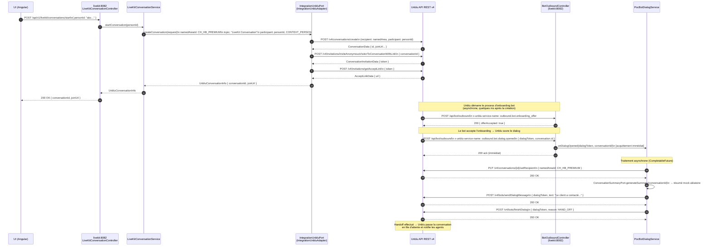
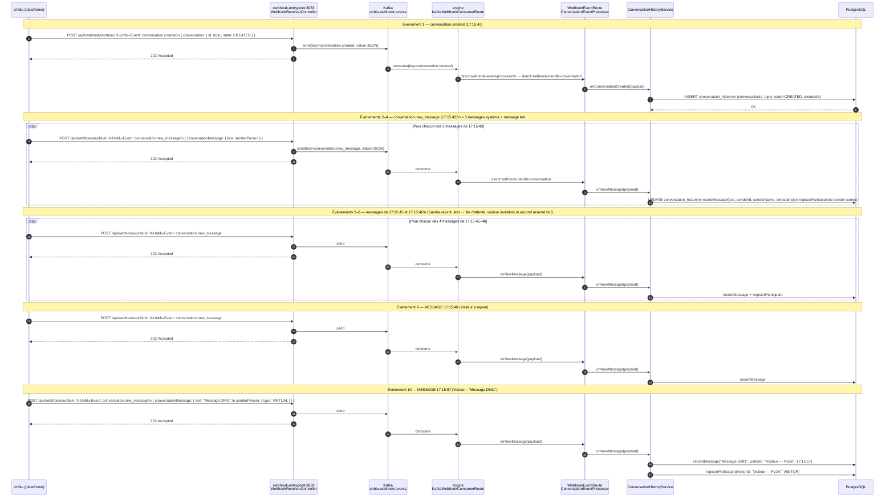

# Séquence complète — Création d'une conversation depuis LiveKit

Ce document retrace tout ce qui se passe, de l'appel REST initial jusqu'aux derniers
événements webhook traités par l'engine. Il s'appuie sur un exemple réel :

```
17:15:42  CREATED
17:15:43  MESSAGE — état : Créé → Processus d'accueil
17:15:43  MESSAGE — Admin a invité un visiteur via lien
17:15:43  MESSAGE — Bot : résumé
17:15:45  MESSAGE — Sandra a rejoint
17:15:45  MESSAGE — état : Processus d'accueil → En file d'attente
17:15:45  MESSAGE — Visiteur a utilisé l'invitation
17:15:46  MESSAGE — Bot : second résumé
17:15:48  MESSAGE — Visiteur a rejoint la conversation
17:15:57  MESSAGE — Visiteur : "Message DMI1"
```

---

## Vue d'ensemble des deux phases

```
Phase 1 — Création et onboarding bot (≈ 3 secondes)
  Appel LiveKit → création Unblu → onboarding_offer → dialog.opened → handoff

Phase 2 — Webhooks reçus et persistés (en continu)
  Unblu → webhook-entrypoint → Kafka → engine → PostgreSQL
```

Les deux phases sont **indépendantes** : la Phase 1 se termine avant que les webhooks
de la Phase 2 commencent à arriver.

---

## Phase 1 — Création et onboarding bot



### Détails importants de la Phase 1

**Étapes 1–10** — L'appel LiveKit est **synchrone** : l'UI attend le retour avec `conversationId`
et `joinUrl` avant de continuer. La création passe par `IntegrationUnbluAdapter` qui appelle
trois endpoints Unblu successifs : création, invitation anonyme, récupération du lien.

**Étapes 11–12** — Unblu envoie `onboarding_offer` **de façon autonome** dès qu'il détecte
le bot configuré sur la namedArea. Le contrôleur répond `offerAccepted: true` de façon synchrone.

**Étapes 13–14** — `dialog.opened` est reçu. Le contrôleur retourne l'acquittement
**immédiatement** (sans attendre la fin du traitement), puis délègue à `PocBotDialogService`
via `CompletableFuture.runAsync()`.

**Étapes 15–20** — Le traitement asynchrone du bot :
1. Positionne la namedArea comme destinataire de la conversation
2. Génère le résumé (`ConversationSummaryPort` — mock dans ce PoC)
3. Envoie le message dans le dialog
4. Exécute le handoff (`HAND_OFF`) pour rendre la main aux agents

---

## Phase 2 — Webhooks et persistance

Chaque événement significatif dans Unblu génère un appel webhook vers `webhook-entrypoint`,
qui publie sur Kafka, puis `engine` consomme et persiste.



---

## Correspondance événements / appels webhook

| # | Heure | Texte dans l'UI | Type webhook | Traitement dans `engine` |
|---|-------|-----------------|-------------|--------------------------|
| 1 | 17:15:42 | CREATED | `conversation.created` | `onConversationCreated` → INSERT |
| 2 | 17:15:43 | état : Créé → Processus d'accueil | `conversation.new_message` | `onNewMessage` → recordMessage |
| 3 | 17:15:43 | Admin a invité un visiteur via lien | `conversation.new_message` | `onNewMessage` → recordMessage |
| 4 | 17:15:43 | Bot : résumé (1er) | `conversation.new_message` | `onNewMessage` → recordMessage |
| 5 | 17:15:45 | Sandra a rejoint | `conversation.new_message` | `onNewMessage` → recordMessage + registerParticipant(Sandra) |
| 6 | 17:15:45 | état : Processus d'accueil → En file d'attente | `conversation.new_message` | `onNewMessage` → recordMessage |
| 7 | 17:15:45 | Visiteur a utilisé l'invitation | `conversation.new_message` | `onNewMessage` → recordMessage |
| 8 | 17:15:46 | Bot : résumé (2nd) | `conversation.new_message` | `onNewMessage` → recordMessage |
| 9 | 17:15:48 | Visiteur a rejoint | `conversation.new_message` | `onNewMessage` → recordMessage |
| 10 | 17:15:57 | Visiteur : "Message DMI1" | `conversation.new_message` | `onNewMessage` → recordMessage + registerParticipant(Visiteur) |

> **Pourquoi deux résumés bot (events 4 et 8) ?**
> Le premier résumé (event 4) est envoyé dans le dialog pendant l'onboarding, **avant**
> que le visiteur ne rejoigne. Le second (event 8) est un second appel `onboarding_offer` /
> `dialog.opened` déclenché quand le visiteur rejoint via le lien d'invitation — Unblu
> considère cette entrée comme un nouveau contexte d'onboarding.

---

## Points d'attention

**Découplage temporel** — L'UI reçoit `conversationId` + `joinUrl` en quelques centaines de
millisecondes (étapes 1–10). Les webhooks arrivent ensuite de façon asynchrone pendant plusieurs
secondes. L'historique en base se construit progressivement.

**Idempotence** — Si un webhook est re-livré par Unblu, `ConversationHistoryService.onNewMessage`
recharge l'entité et appelle `recordMessage`. Si le message est déjà en base, la contrainte
unique (`conversation_id + timestamp + sender`) déclenche une `DataIntegrityViolationException`
capturée par `WebhookEventRoute` et ignorée silencieusement.

**Ordre des messages** — Kafka garantit l'ordre dans une partition. Tous les webhooks de
cette conversation sont envoyés avec la même clé (`conversation.new_message`), ce qui garantit
qu'ils arrivent dans l'ordre d'envoi dans la même partition du topic `unblu.webhook.events`.
