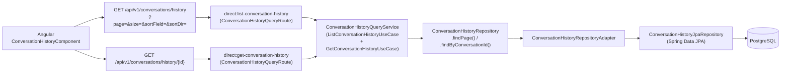

# 📋 Consultation IHM — Historique des Conversations

Ce document décrit la feature de consultation de l'historique des conversations persistées en base de données : API de listing paginée et triée, détail par conversation, et interface Angular.

## 🎯 Objectif

Permettre aux opérateurs de consulter l'historique complet des conversations synchronisées, de les trier selon différents critères métier, et d'accéder au détail complet (participants + événements chronologiques) d'une conversation sélectionnée.

---

## 🧱 Architecture de la Feature



---

## 🧩 Composants Impliqués

| Couche | Classe | Rôle |
|--------|--------|------|
| Port d'entrée | `ListConversationHistoryUseCase` | Listing paginé + trié |
| Port d'entrée | `GetConversationHistoryUseCase` | Détail complet par ID |
| Query objet | `ListConversationHistoryQuery` | Encapsule page, size, sortField, sortDirection avec validation + parsing sécurisé |
| Application | `ConversationHistoryQueryService` | Implémente les deux use cases, délègue au repository |
| Application (Camel) | `ConversationHistoryQueryRoute` | Routes `direct:` lisant les headers Camel (page, size, sortField, sortDir) |
| Domaine (modèles) | `ConversationHistory`, `ConversationHistoryPage` | Entité et page domaine |
| Domaine (enums) | `ConversationSortField`, `ConversationSortDirection` | Valeurs de tri exposées par l'API |
| Port de sortie | `ConversationHistoryRepository` | Contrat de lecture en base |
| Infrastructure | `ConversationHistoryRepositoryAdapter` | Implémentation JPA, gestion du tri avec NULLS LAST |
| Infrastructure | `ConversationHistoryJpaRepository` | Interface Spring Data JPA avec requêtes JPQL custom |
| Exposition | `RestExpositionRoute` | Endpoints REST, déclaration des query params |
| Exposition | `ConversationHistoryQueryMapper` | Mapping domaine → DTOs REST (Instant → String ISO 8601) |

---

## 📦 Modèles Domaine

### `ConversationHistoryPage`

```java
record ConversationHistoryPage(
    List<ConversationHistory> items,  // copie défensive
    long totalItems,
    int page,
    int size,
    int totalPages
)
```

### `ConversationHistory` (résumé, sans événements ni participants)

Utilisé pour le listing — les collections `events` et `participants` ne sont **pas** chargées (prévention du N+1).

### `ConversationHistory` (détail complet)

Chargé via `findByConversationId()` avec force-initialisation des collections lazy dans la transaction. Les événements sont retournés dans l'ordre `occurredAt` croissant côté mapper.

### Enums de tri

| Enum | Valeurs | Colonne DB | Nullable |
|------|---------|-----------|---------|
| `ConversationSortField` | `CREATED_AT`, `ENDED_AT`, `TOPIC` | `created_at`, `ended_at`, `topic` | Non / Oui / Oui |
| `ConversationSortDirection` | `ASC`, `DESC` | — | — |

---

## 🔀 Stratégie de Tri et NULLS LAST

Spring Data JPA 3.x ne supporte pas `Sort.NullHandling.NULLS_LAST` via l'API Criteria (utilisée par `findAll(Pageable)`). La stratégie retenue :

| Champ de tri | Nullable | Implémentation |
|-------------|---------|---------------|
| `CREATED_AT` | Non | `Sort.by("createdAt").ascending/descending()` — Sort standard |
| `ENDED_AT` | Oui | Requête JPQL `@Query` avec `ORDER BY c.endedAt ASC/DESC NULLS LAST` |
| `TOPIC` | Oui | Requête JPQL `@Query` avec `ORDER BY c.topic ASC/DESC NULLS LAST` |

Les méthodes JPQL custom sont déclarées dans `ConversationHistoryJpaRepository` :
- `findAllOrderByEndedAtAsc(Pageable)` / `findAllOrderByEndedAtDesc(Pageable)`
- `findAllOrderByTopicAsc(Pageable)` / `findAllOrderByTopicDesc(Pageable)`

Pour `ENDED_AT` et `TOPIC`, le `Pageable` passé est **non trié** (`PageRequest.of(page, size)`) — le tri est entièrement géré par le JPQL.

---

## 🌐 REST API

### Listing paginé et trié

```
GET /api/v1/conversations/history
```

| Paramètre | Type | Défaut | Description |
|-----------|------|--------|-------------|
| `page` | `int` | `0` | Numéro de page (0-indexé) |
| `size` | `int` | `10` | Éléments par page (1–100) |
| `sortField` | `String` | `CREATED_AT` | `CREATED_AT` \| `ENDED_AT` \| `TOPIC` |
| `sortDir` | `String` | `DESC` | `ASC` \| `DESC` |

**Réponse type (200 OK) :**

```json
{
  "items": [
    {
      "conversationId": "abc123",
      "topic": "Demande remboursement",
      "createdAt": "2026-03-15T10:30:00Z",
      "endedAt": "2026-03-15T10:45:00Z",
      "status": "ENDED"
    }
  ],
  "totalItems": 250,
  "page": 0,
  "size": 10,
  "totalPages": 25
}
```

> **Note Jackson** : les champs `createdAt`, `endedAt`, `occurredAt` sont des `String` ISO 8601 dans tous les DTOs REST. Camel REST DSL utilise sa propre instance `ObjectMapper` sans `JavaTimeModule` — l'utilisation de `java.time.Instant` dans les DTOs causerait une erreur 500 silencieuse.

### Détail d'une conversation

```
GET /api/v1/conversations/history/{conversationId}
```

- **200 OK** : `ConversationHistoryDetailResponse` avec `participants[]` et `events[]` (triés par `occurredAt` ASC).
- **404 Not Found** : conversation inconnue en base.

---

## 🖥️ Interface Angular — `ConversationHistoryComponent`

### Layout

L'onglet **Historique** est structuré en deux zones :

```
┌─────────────────────────────────────────────────────────────┐
│ Stats bar : N conversations ▫ Page X/Y           [↺ reload] │
├──────────────────────────────┬──────────────────────────────┤
│  Tableau des conversations   │  Panneau détail (sticky)     │
│  ┌──────┬────────┬────┬────┐ │  ┌ Sujet + Statut  [↺] [✕] ┐│
│  │Statut│ Sujet↑↓│Début↑↓│Fin↑↓│ │  │ Participants chips     ││
│  ├──────┴────────┴────┴────┤ │  │ Timeline événements      ││
│  │ ACTIVE │ Demande… │ …  │ │  └──────────────────────────┘│
│  └──────────────────────────┘ │                              │
│  Pagination «‹ 1 2 3 ›»      │                              │
└──────────────────────────────┴──────────────────────────────┘
```

### Tri interactif

| Action utilisateur | Comportement |
|-------------------|-------------|
| Clic sur un en-tête déjà actif | Inverse la direction (ASC ↔ DESC) |
| Clic sur un autre en-tête | Active ce champ, repart en DESC |
| Indicateurs visuels | ↑ (ASC) ou ↓ (DESC) après le libellé ; colonne active en bleu |
| Effet de bord | Revient automatiquement à la page 0 |

### Boutons de rechargement

| Bouton | Position | Comportement |
|--------|----------|-------------|
| `↺` liste | Barre de stats (droite) | Recharge la page courante avec le tri actif |
| `↺` détail | En-tête du panneau détail | Recharge la conversation affichée depuis l'API |

### État et services Angular

```typescript
// État de tri
sortField: string = 'CREATED_AT';
sortDir: string = 'DESC';

// Méthode principale
loadPage(page: number): void  // charge via apiService.getConversationHistory(page, size, sortField, sortDir)

// Tri
sortBy(field: string): void   // toggle direction ou change de champ
sortIndicator(field: string): string  // retourne ' ↑', ' ↓' ou ''

// Rechargements
reloadList(): void            // loadPage(currentPage?.page ?? 0)
reloadDetail(): void          // loadDetail(selectedConversation.conversationId)
```

---

## ⚠️ Points d'Attention

- **Chargement lazy** : `toDomainSummary()` dans `ConversationHistoryMapper` est une méthode dédiée qui ne touche **jamais** les collections `participants` ni `events` — réservée exclusivement au listing pour éviter le N+1.
- **Transaction** : `findByConversationId()` force l'initialisation des collections lazy (`entity.getParticipants().size()`) **dans la même transaction** `@Transactional(readOnly = true)`. Ne jamais déplacer cette initialisation hors transaction.
- **Pagination sans résultat** : si la page demandée dépasse le nombre total de pages, Spring Data retourne une page vide (pas d'erreur). L'Angular affiche l'état vide.
- **Sensibilité casse** : les valeurs `sortField` et `sortDir` passées en query param sont normalisées en `toUpperCase()` par `ListConversationHistoryQuery`. `created_at`, `CREATED_AT` ou `Created_At` sont tous équivalents.
