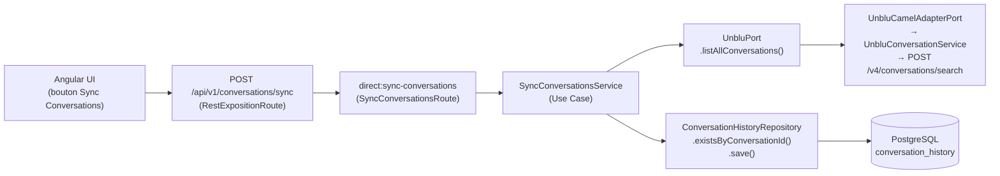

# 🔄 Synchronisation des Conversations Unblu → Base de Données

Ce document décrit la feature de synchronisation à la demande : scan de toutes les conversations présentes dans Unblu, puis persistance idempotente dans la base de données locale.

## 🎯 Objectif

Donner à l'opérateur la capacité de prendre une "photo" de l'état des conversations Unblu et de l'importer en base, sans risque de doublons et sans interrompre le traitement en cas d'erreur individuelle.

---

## 🧱 Architecture de la Feature



---

## 🧩 Composants Impliqués

| Couche | Classe | Rôle |
|--------|--------|------|
| Port d'entrée (use case) | `SyncConversationsUseCase` | Interface du cas d'utilisation |
| Application | `SyncConversationsService` | Logique de synchronisation, idempotence, isolation des erreurs |
| Application (Camel) | `SyncConversationsRoute` | Route `direct:sync-conversations` |
| Domaine (modèle) | `UnbluConversationSummary` | Résumé d'une conversation lue depuis Unblu |
| Domaine (modèle) | `ConversationSyncResult` | Rapport de synchronisation |
| Port de sortie Unblu | `UnbluPort.listAllConversations()` | Contrat de lecture vers Unblu |
| Port de sortie repo | `ConversationHistoryRepository` | Contrat de persistance |
| Infrastructure Unblu | `UnbluCamelAdapterPort` + `UnbluConversationService` | Implémentation de l'appel SDK |
| Exposition REST | `RestExpositionRoute` + `SyncConversationsMapper` | Endpoint `POST /conversations/sync`, mapping DTO |

---

## 🔁 Logique d'Idempotence

Pour chaque `UnbluConversationSummary` retournée par Unblu :

```mermaid
flowchart TD
    A[Pour chaque conversation Unblu] --> B{Existe déjà\nen base ?}
    B -- Non --> C[Créer ConversationHistory\n+ endedAt si terminée\n→ repository.save]
    B -- Oui --> D{Est terminée\ndans Unblu ?}
    D -- Non --> E[Rien à faire\nalreadyExisting++]
    D -- Oui --> F{Déjà marquée\nterminée en base ?}
    F -- Oui --> E
    F -- Non --> G[Mettre à jour endedAt\n→ repository.save\nalreadyExisting++]
    C --> H{Exception ?}
    G --> H
    H -- Non --> I[newlyPersisted++ ou alreadyExisting++]
    H -- Oui --> J[Log erreur\nerrorIds.add(id)\nContinue sur les suivantes]
```

**Règles métier :**
- Une conversation déjà en base et non terminée n'est **pas** modifiée (opération idempotente).
- Une conversation terminée dans Unblu mais dont le `endedAt` n'est pas encore en base est **mise à jour** (cloison de synchronisation).
- Chaque erreur individuelle est **isolée** : un échec n'interrompt pas le traitement des conversations suivantes.

---

## 📦 Modèle de Résultat : `ConversationSyncResult`

```java
record ConversationSyncResult(
    int totalScanned,       // nombre total de conversations lues depuis Unblu
    int newlyPersisted,     // nouvelles conversations insérées en base
    int alreadyExisting,    // conversations déjà présentes (avec ou sans mise à jour)
    int errors,             // nombre d'erreurs rencontrées
    List<String> errorConversationIds  // IDs des conversations en erreur (copie défensive)
)
```

---

## 🌐 REST API

### Endpoint

```
POST /api/v1/conversations/sync
Content-Type: application/json (corps vide)
```

### Réponse type (200 OK)

```json
{
  "totalScanned": 250,
  "newlyPersisted": 12,
  "alreadyExisting": 238,
  "errors": 0,
  "errorConversationIds": [],
  "message": "Synchronisation terminée : 250 conversations scannées, 12 nouvelles, 238 déjà existantes."
}
```

### Fallback Unblu indisponible

Si le circuit breaker déclenche le fallback, `listAllConversations()` retourne `List.of()`.
La synchronisation se termine avec `totalScanned = 0` et aucune erreur — pas d'exception propagée.

---

## 🖥️ Interface Angular

Le bouton **Sync Conversations** se trouve dans l'onglet principal de l'application.

- **État loading** : le bouton est désactivé et affiche "Synchronisation…" pendant l'appel.
- **Bannière résultat** : affiche le champ `message` du `ConversationSyncResult` après succès.
- **Erreurs individuelles** : si `errors > 0`, les IDs des conversations en erreur sont listés dans la bannière.

---

## ⚠️ Points d'Attention

- **Volume** : `POST /v4/conversations/search` sans filtre retourne **toutes** les conversations de l'instance Unblu. Sur des instances chargées (milliers de conversations), envisager une pagination SDK.
- **Timing** : la synchronisation est synchrone côté HTTP — pour de gros volumes, prévoir une exécution en tâche de fond avec retour du résultat via SSE ou polling.
- **Webhook vs Sync** : la synchronisation à la demande est un filet de sécurité. Le canal principal de persistance des événements est le système de webhooks Unblu.
