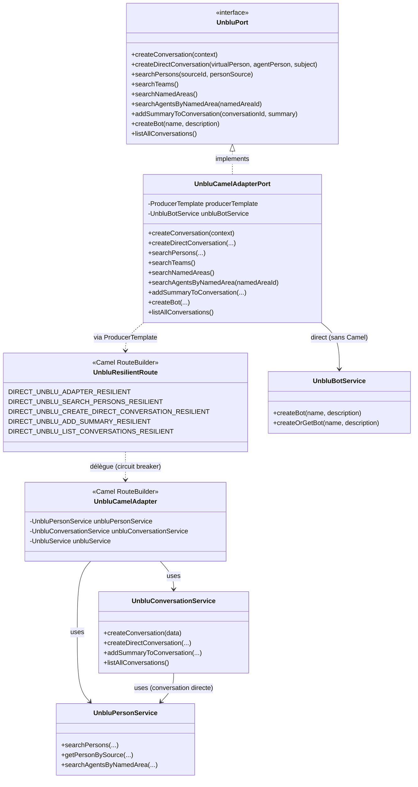

# Guide de l'Adaptateur Unblu (Infrastructure)

Ce guide est le point d'entrée de la documentation technique de l'adaptateur Unblu.
Il couvre l'ensemble des fonctionnalités disponibles : création de conversations, listing et synchronisation depuis Unblu, gestion des personnes et entités, ainsi que la consultation IHM de l'historique persisté.

## 🧱 Organisation Générale

L'adaptateur suit les principes de l'**Architecture Hexagonale**. Il se situe dans le module `unblu-infrastructure` et implémente les ports de sortie définis dans `unblu-domain`.

### Diagramme de classes (Architecture Globale)

### Les couches de l'adaptateur

| # | Couche | Classe principale | Rôle |
|---|--------|------------------|------|
| 1 | **Port de sortie** | `UnbluPort` | Contrat défini par le domaine — ce que l'application peut faire avec Unblu |
| 2 | **Façade d'implémentation** | `UnbluCamelAdapterPort` | Implémente `UnbluPort`, délègue à Camel via `ProducerTemplate` |
| 3 | **Couche de résilience** | `UnbluResilientRoute` | Circuit breaker Resilience4j (timeout 3 000 ms), fallback par opération |
| 4 | **Routes techniques** | `UnbluCamelAdapter` | Routes Camel `direct:` qui invoquent les services SDK |
| 5 | **Services SDK** | `UnbluConversationService`, `UnbluPersonService`, `UnbluBotService`, `UnbluService` | Appels directs à l'API REST Unblu via le SDK jersey3 |

---

## 📂 Documentation par domaine de responsabilité

| Document | Périmètre |
|----------|-----------|
| [Gestion des Conversations](./conversations.md) | Création standard, directe (1-à-1), résumé bot |
| [Gestion des Personnes et Agents](./persons.md) | Recherche d'utilisateurs, agents par zone, disponibilité |
| [Configuration et Entités](./core-services.md) | Teams, Named Areas, Bots (création idempotente) |

> La synchronisation des conversations et la consultation de l'historique sont documentées
> dans [`integration/unblu-adapter-doc/`](../../integration/unblu-adapter-doc/index.md) —
> elles dépendent des modules `integration-*` et de `IntegrationUnbluPort`.

---

## 💡 Concepts Clés

- **Immutabilité** : Les échanges entre couches utilisent des `record` Java. Aucune donnée ne peut être modifiée par effet de bord.
- **Conversion de modèles** : Le domaine ne connaît jamais les classes du SDK Unblu (`ConversationData`, `PersonData`…). Les adaptateurs sont seuls responsables du mapping vers les objets domaine.
- **Résilience par opération** : Chaque appel Unblu passe par un circuit breaker dédié avec un fallback adapté à la criticité. La création de conversation retourne `OFFLINE-PENDING` ; le listing retourne une liste vide.
- **Gestion des erreurs** : Toutes les `ApiException` du SDK sont encapsulées en `UnbluApiException` (infrastructure) pour être gérées proprement par la couche application.
