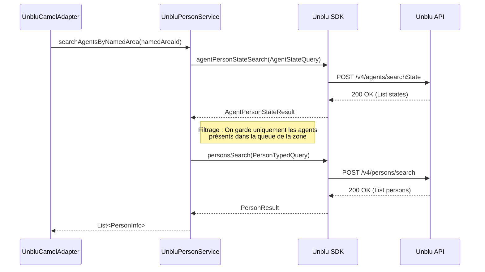

# 👤 Gestion des Personnes et Agents Unblu

Ce document vous explique comment nous gérons les identités dans Unblu : que ce soit pour trouver un agent ou identifier un visiteur.

## 🧱 Service Principal : `UnbluPersonService`

Ce service s'occupe de toute la recherche et du mapping des identités. Il communique avec Unblu via `PersonsApi`.

### Séquence : Recherche d'agents par Zone Nommée

C'est un scénario qui demande plusieurs étapes pour garantir que l'on ne propose que des agents réellement disponibles :

### Endpoints Unblu sous-jacents

- `POST /v4/persons/search` : Recherche générique de personnes (agents, visiteurs, bots).
- `GET /v4/persons/getBySource` : Récupération directe d'une personne par son identifiant métier original.
- `POST /v4/agents/searchState` : Recherche des états de disponibilité des agents.

---

## 🏃 Scénarios d'Usage

### 1. Recherche de personnes (Search)
Pour trouver un agent ou un visiteur spécifique à partir de critères techniques.
- **Entrée** : `sourceId` et `personSource` (VIRTUAL ou USER_DB).
- **Cas Nominal** : Retourne une liste de `PersonInfo` (notre modèle de domaine).
- **Transformation** : Le service transforme les objets Unblu `PersonData` en `PersonInfo` en mappant les champs `id`, `displayName`, et en calculant si c'est un agent ou non via le `personType`.

### 2. Récupération par Source (GetBySource)
Essentiel pour faire le lien entre notre système et Unblu de manière idempotente.
- **Cas Nominal** : Si la personne existe, elle est renvoyée.
- **Cas d'Erreur (404 Not Found)** : Si la personne n'est pas encore connue d'Unblu, une erreur 404 est retournée par l'API. Le service propage alors une `UnbluApiException`.

### 3. Recherche d'agents par Zone (Named Area)
Utilisé pour router une conversation vers un agent travaillant dans une zone spécifique (ex: un pays, un service client particulier).
- **Cas Nominal** : 
  1. On cherche d'abord les états des agents liés à la zone (`NamedArea`).
  2. On filtre pour ne garder que ceux qui sont réellement présents.
  3. On retourne la liste des agents disponibles.
- **Complexité** : Ce scénario combine plusieurs appels API pour garantir que l'agent peut réellement prendre le chat.

---

## ⚠️ Points d'attention pour les dévs

- **Types de personnes** : Unblu différencie les personnes "VIRTUAL" (souvent les visiteurs) des personnes "USER_DB" (souvent les agents de l'organisation).
- **Availability** : Ne supposez pas qu'un agent trouvé par recherche est disponible pour discuter immédiatement. Il faut souvent vérifier son état via le `searchAgentsByState`.
