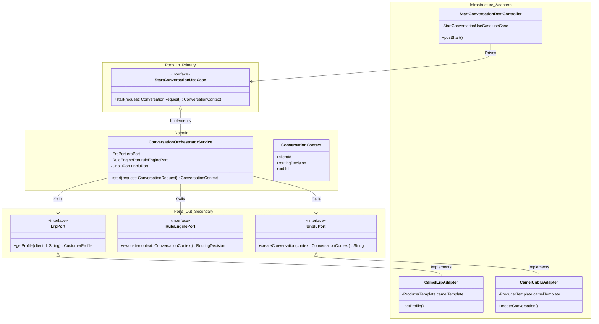
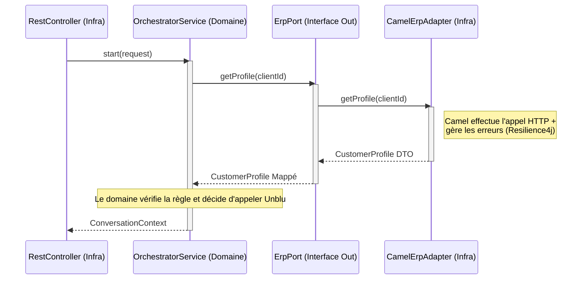
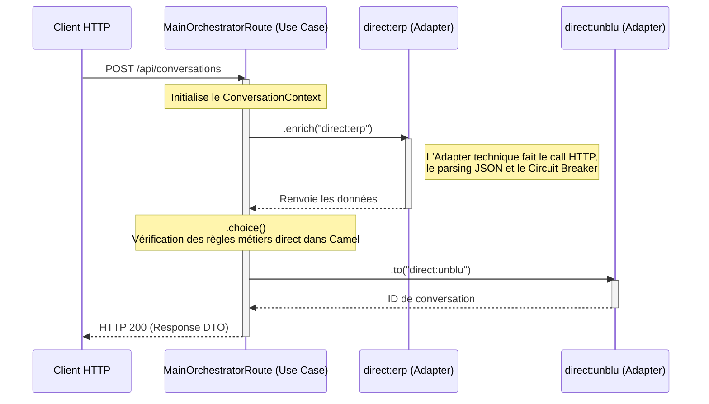

# L'Orchestration en Architecture Hexagonale : Stricte vs Pragmatique

Lorsque l'objectif principal d'une application est d'orchestrer des appels entre plusieurs systèmes (API Gateway, BFF, EAI), on fait face à un dilemme en architecture hexagonale : le "métier" est défini par le flux d'orchestration lui-même. 

Voici le détail des deux approches possibles avec des diagrammes pour illustrer où se situent les ports et les interfaces.

---

## 1. Approche Hexagonale STRICTE 👑

Dans cette approche, le domaine reste pur. Le séquenceur (l'orchestrateur) est un Service Java classique dans le domaine. Apache Camel est relégué *exclusivement* à l'infrastructure pour faire les appels techniques.

### Diagramme de Classes (Stricte)



### Diagramme de Séquence (Stricte)



**Avantages :** 
- Pureté architecturale, le domaine est testable unitairement en isolation (avec des Mocks).
- Les interfaces "In" et "Out" (Primary/Secondary) existent physiquement dans le code abstrait.

**Inconvénients :** 
- Effet "Passe-plat". On se retrouve à coder des micro-routes Camel qui ne font qu'un seul appel HTTP, et un service Java qui gère manuellement l'orchestration, alors que Camel est fait exactement pour ça.

---

## 2. Approche Hexagonale PRAGMATIQUE (Celle de la documentation actuelle) 🚀

Dans cette approche, on assume que pour un composant d'orchestration, la définition du flux (la Route Camel principale) **EST** la règle métier. On remonte donc la route Camel principale au niveau du Cas d'Utilisation.

### Diagramme de Classes (Pragmatique)

```mermaid
classDiagram
    namespace Domain_Models {
        class ConversationContext {
            +clientId
            +routingDecision
            +unbluId
        }
        class ChatAccessDeniedException {
            +reason
        }
    }

    namespace UseCase_Infrastructure {
        class MainOrchestratorRoute {
            <<Camel RouteBuilder>>
            +configure()
        }
    }

    namespace Adapters_Infrastructure {
        class ErpCamelRouteAdapter {
            <<Camel RouteBuilder>>
            +configure()
        }
        class UnbluCamelRouteAdapter {
            <<Camel RouteBuilder>>
            +configure()
        }
    }

    MainOrchestratorRoute ..> ConversationContext : Manipule (Objet Pivot)
    MainOrchestratorRoute --> ErpCamelRouteAdapter : .to("direct:erp")
    MainOrchestratorRoute --> UnbluCamelRouteAdapter : .to("direct:unblu")
```

### Diagramme de Séquence (Pragmatique)



**Avantages :**
- Moins de code "boilerplate" (pas de classes métiers passe-plat ou d'interfaces vides).
- Toute l'orchestration est lisible à un seul endroit (`MainOrchestratorRoute`), avec la puissance de Camel (gestion des erreurs, transactions, EIP).

**Inconvénients :**
- Le couplage fort avec Camel. Le framework technique (Camel) décrit la séquence métier. Les ports IN/OUT n'existent plus sous forme d'interfaces Java, mais sous forme de "points de terminaison Camel" (`direct:xyz` ou `rest()`).

---

## Conclusion et Choix pour Unblu

Le document historique `camel_orchestration_pattern.md` privilégiait l'approche **Pragmatique**. C'est pour cela que tu ne trouvais pas les interfaces dans `primary` et `secondary`, car le métier (la séquence d'appels) était localisé dans l'infrastructure via la route Camel de l'orchestrateur.

💡 **Mon Conseil pour ton Projet :** Si tu souhaites une séparation plus académique pour bien avoir tes interfaces dans `domain/port/primary` et `domain/port/secondary`, nous devrions basculer sur l'**Approche Stricte**. Dans ce cas, nous allons coder les interfaces, créer un vrai `ConversationOrchestratorService` dans le domaine, et Camel ne servira que de "composant technique HTTP" dans l'infra.
