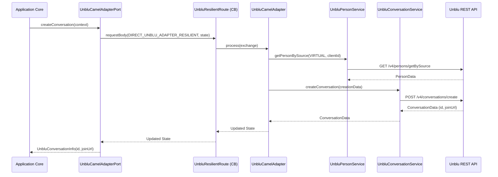
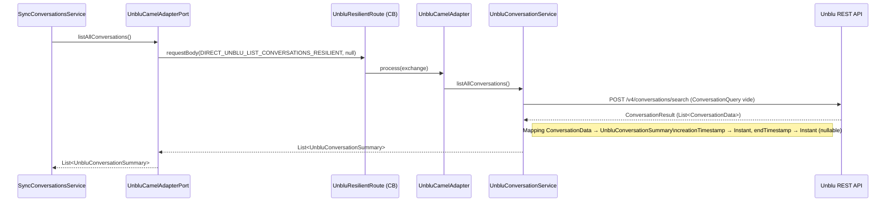

# 🗨️ Gestion des Conversations Unblu

Ce document détaille tout ce qui touche au cycle de vie des conversations Unblu : création, liaison 1-à-1, ajout de résumé, et listing pour synchronisation.

## 🧱 Service Principal : `UnbluConversationService`

Ce service utilise le SDK Unblu via `ConversationsApi` et `BotsApi`. Toutes les `ApiException` levées par le SDK sont interceptées et retransformées en `UnbluApiException`.

---

## 🏃 Scénarios d'Usage

### 1. Création d'une conversation standard (vers une équipe)

Cas nominal : un visiteur demande un chat ; le système le route vers une équipe d'agents.

**Flux de séquence :**

- **Fallback circuit breaker** : retourne un `ConversationOrchestrationState` avec l'ID `OFFLINE-PENDING`.

---

### 2. Création d'une conversation directe (1-à-1)

Met directement en relation un visiteur et un agent connu.

- **Validation métier** : si l'`agentPerson` fourni n'est pas de type `AGENT`, une `UnbluApiException(400)` est levée avant même d'appeler l'API.
- **Participants** : le visiteur est ajouté avec le rôle `CONTEXT_PERSON`, l'agent avec `ASSIGNED_AGENT`.
- **Endpoint Unblu** : `POST /v4/conversations/create` (même endpoint, paramètres différents).
- **Fallback** : retourne un `ConversationData` avec l'ID `OFFLINE-PENDING`.

---

### 3. Ajout d'un résumé via Bot

Utilisé en fin de parcours pour laisser une trace textuelle dans la conversation.

- **Prérequis** : `unblu.api.summary-bot-person-id` doit être configuré. Si absent → warning loggé, opération silencieusement ignorée.
- **Processus** :
  1. `POST /v4/conversations/{id}/addParticipant` — ajout du bot en mode `hidden: true`.
  2. `POST /v4/bots/sendMessage` — envoi du résumé sous forme de `TextPostMessageData`.
- **Fallback** : résumé ignoré silencieusement (non critique).

---

### 4. Listing de toutes les conversations (`listAllConversations`)

Récupère la liste complète des conversations présentes dans Unblu pour alimenter la synchronisation en base.

**Flux de séquence :**

**Modèle de sortie `UnbluConversationSummary` :**

| Champ | Type | Source Unblu |
|-------|------|-------------|
| `id` | `String` | `ConversationData.getId()` |
| `topic` | `String` | `ConversationData.getTopic()` |
| `state` | `String` | `ConversationData.getState().name()` |
| `createdAt` | `Instant` | `getCreationTimestamp()` → `Instant.ofEpochMilli()` |
| `endedAt` | `Instant` (nullable) | `getEndTimestamp()` → `null` si absent |

- **Fallback** : retourne `List.of()` — la synchronisation est sautée sans erreur.

---

## 📡 Endpoints Unblu utilisés

| Méthode | Endpoint | Utilisation |
|---------|----------|-------------|
| `POST` | `/v4/conversations/create` | Création conversation standard et directe |
| `POST` | `/v4/conversations/{id}/addParticipant` | Ajout du bot résumé |
| `POST` | `/v4/bots/sendMessage` | Envoi du message de résumé |
| `POST` | `/v4/conversations/search` | Listing de toutes les conversations |

---

## ⚠️ Gestion des Erreurs

| Code HTTP | Cause | Comportement |
|-----------|-------|-------------|
| `400` | Agent fourni n'est pas de type `AGENT` | `UnbluApiException(400)` levée avant l'appel API |
| `403` | Droits insuffisants sur la clé API | `UnbluApiException(403)` avec message explicite |
| `404` | Ressource inexistante (personne, conversation) | `UnbluApiException(404)` propagée |
| Autres | Erreur technique SDK | `UnbluApiException` avec code HTTP d'origine |
