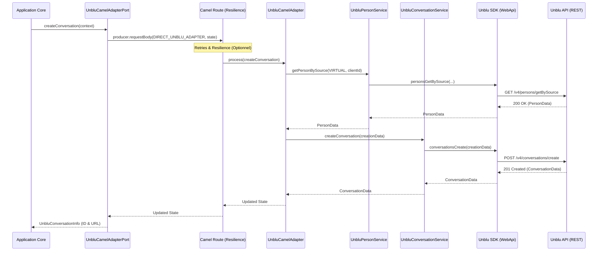

# 🗨️ Gestion des Conversations Unblu

Ce document détaille comment nous gérons les interactions de chat via Unblu. En tant que développeur, c'est ici que vous viendrez pour tout ce qui touche au cycle de vie d'une conversation.

## 🧱 Service Principal : `UnbluConversationService`

Ce service est le cœur de la manipulation des conversations. Il utilise le SDK Unblu et appelle l'API REST via `ConversationsApi`.

### Flux de création de conversation

Voici le diagramme de séquence pour le cas nominal de création de conversation. Ce diagramme illustre bien l'orchestration à travers les différentes couches :

### Endpoints Unblu sous-jacents

- `POST /v4/conversations/create` : Création de tout type de conversation (standard ou directe).
- `POST /v4/conversations/{conversationId}/addParticipant` : Ajout d'un participant (ex: un Bot pour envoyer un résumé).
- `POST /v4/bots/sendMessage` : Envoi d'un message technique ou de bot.

---

## 🏃 Scénarios d'Usage

### 1. Création d'une conversation standard
C'est le cas nominal d'un client qui demande un chat.
- **Entrée** : `ConversationContext` (contenant le type de routing, l'ID client, etc.).
- **Processus** :
  1. On identifie le destinataire (Equipe/Team).
  2. On récupère la personne virtuelle (Client) via `UnbluPersonService`.
  3. On appelle `createConversation` sur le SDK Unblu.
- **Sortie** : `UnbluConversationInfo` (ID de conversation et URL de join).

### 2. Création d'une conversation directe (1-à-1)
Utilisé pour mettre directement en relation deux personnes connues.
- **Entrée** : `virtualPerson`, `agentPerson`, `subject`.
- **Cas Nominal** : L'agent est bien de type `AGENT`, la conversation est créée et les deux sont ajoutés comme participants.
- **Cas d'Erreur (Validation)** : Si l'agent fourni n'est pas un agent (ex: une autre personne virtuelle), une `UnbluApiException` (400 Bad Request) est lancée.

### 3. Ajout d'un résumé via un Bot
Souvent utilisé en fin de parcours pour laisser une trace textuelle.
- **Entrée** : `conversationId`, `summary`.
- **Cas Nominal** : 
  1. Le bot "résumé" est ajouté de manière invisible à la conversation.
  2. Un message de type "Text Post" est envoyé par ce bot.
- **Cas Particulier** : Si l'identifiant du bot n'est pas configuré dans `application.properties`, l'opération est ignorée avec un avertissement (Warning) dans les logs.

---

## ⚠️ Gestion des Erreurs

En cas de problème avec l'API Unblu, nous gérons plusieurs cas :
1.  **403 Forbidden** : Souvent un problème de droits d'accès au niveau de la clé API Unblu. Message : "Permissions insuffisantes".
2.  **400 Bad Request** : Paramètres invalides (ex: ID d'agent inexistant ou incorrect).
3.  **Autres Erreurs API** : Toutes les autres exceptions du SDK Unblu sont encapsulées dans une `UnbluApiException` générique qui porte le code HTTP original.
