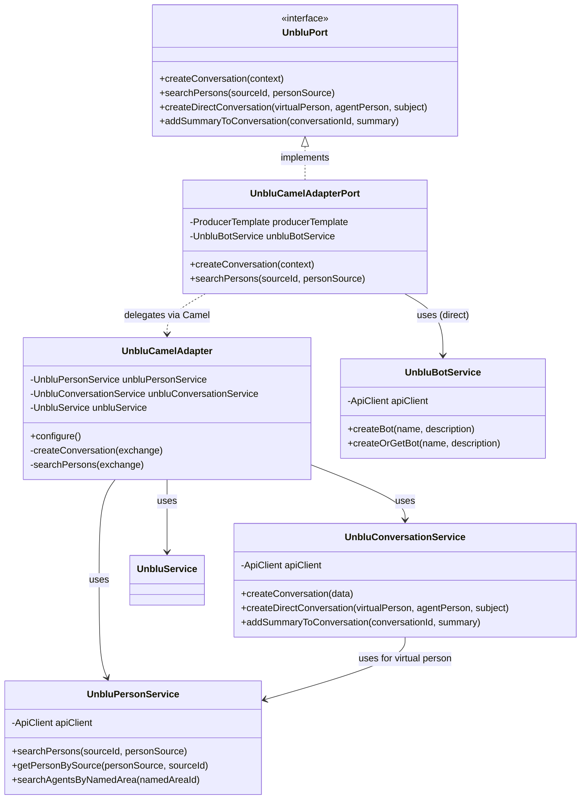

# Guide de l'Adaptateur Unblu (Infrastructure)

Bienvenue dans la documentation de l'adaptateur Unblu. En tant que Tech Lead, mon objectif est de vous expliquer comment nous avons structuré notre pont vers la solution Unblu et comment l'utiliser correctement.

## 🧱 Organisation Générale

L'adaptateur Unblu suit les principes de l'**Architecture Hexagonale**. Il se situe dans la couche `infrastructure` et implémente le port de sortie défini dans le domaine.

### Diagramme de Classe (Architecture Globale)

Voici comment nos classes interagissent. Notez comment `UnbluCamelAdapterPort` sert de façade propre, cachant la complexité de Camel et des appels SDK directs.

### Les couches de l'adaptateur :

1.  **Le Port (Interface)** : `UnbluPort` (dans le domaine) définit *ce que* l'application peut faire avec Unblu.
2.  **L'Adaptateur de Point d'Entrée** : `UnbluCamelAdapterPort` est la classe principale. Elle implémente `UnbluPort` et délègue le travail à des routes Apache Camel pour la résilience.
3.  **La Couche de Résilience** : `UnbluResilientRoute` utilise des mécanismes comme les retries ou les disjoncteurs (Circuit Breaker) avant d'appeler les services réels.
4.  **Le Cœur de l'Adaptateur Camel** : `UnbluCamelAdapter` définit les routes techniques et fait le lien avec les services spécialisés.
5.  **Les Services Unblu (SDK)** : Ce sont des classes qui utilisent directement le SDK Unblu (via `ApiClient`) pour parler à l'API REST d'Unblu.

## 📂 Documentation par Service

Pour plus de clarté, la documentation est découpée par domaine de responsabilité. Chaque document détaille les services, les endpoints Unblu touchés, et les scénarios d'usage (nominaux et erreurs) :

- [**Gestion des Conversations**](./conversations.md) : Création de chats, conversations directes 1-à-1, ajout de résumés.
- [**Gestion des Personnes et Agents**](./persons.md) : Recherche d'utilisateurs, d'agents par zone géographique ou disponibilité.
- [**Configuration et Entités**](./core-services.md) : Gestion des équipes (Teams), des zones (Named Areas) et des Bots.

## 💡 Concepts Clés pour les Débutants

- **Immutabilité** : Nous utilisons des `record` Java pour les requêtes entre les couches. Cela garantit que les données ne sont pas modifiées par surprise.
- **Conversion de modèles** : Le domaine ne connaît pas les classes du SDK Unblu (comme `ConversationData`). C'est le rôle de l'adaptateur de transformer les objets Unblu en objets de notre domaine (`UnbluConversationInfo`).
- **Gestion des erreurs** : Toutes les erreurs du SDK Unblu (`ApiException`) sont interceptées et transformées en `UnbluApiException` (une exception de notre infrastructure) pour être traitées proprement par notre système.
